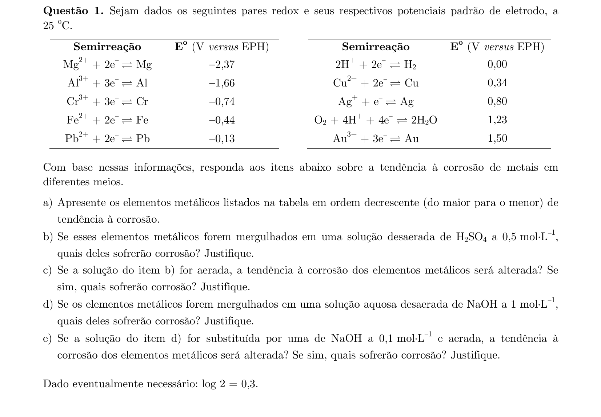
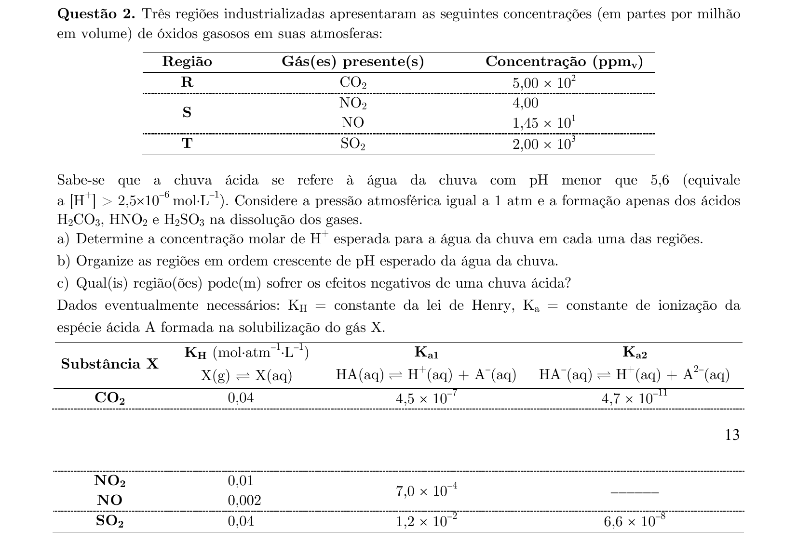
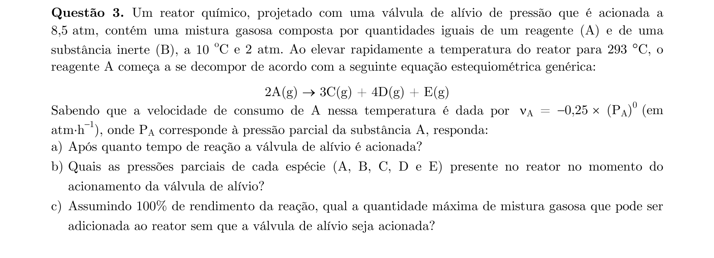
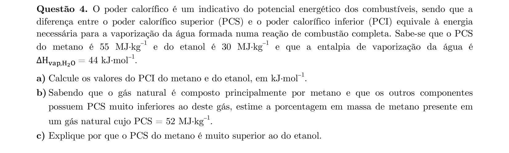
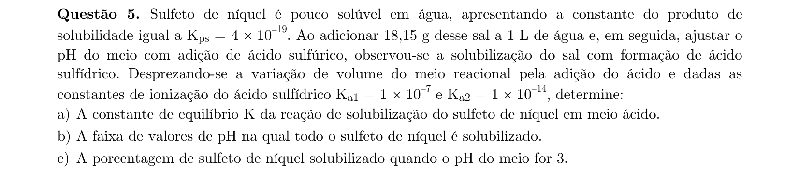
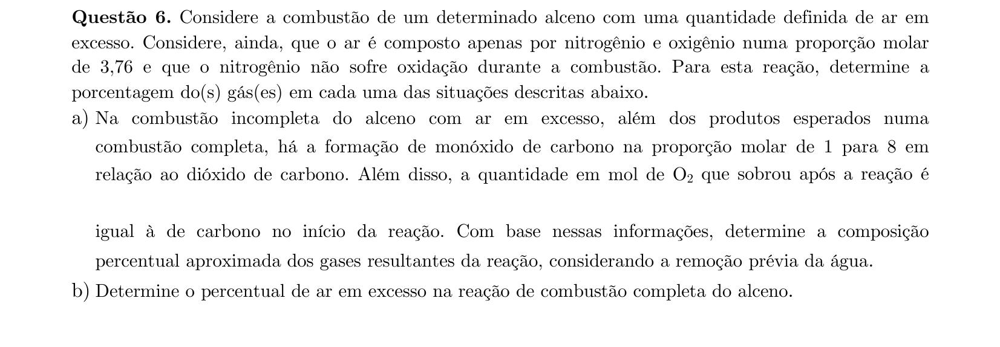
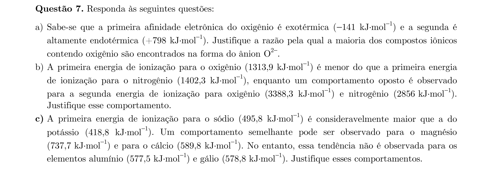
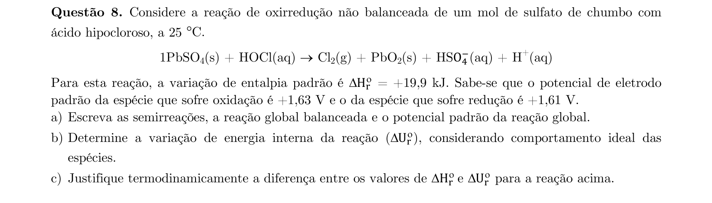
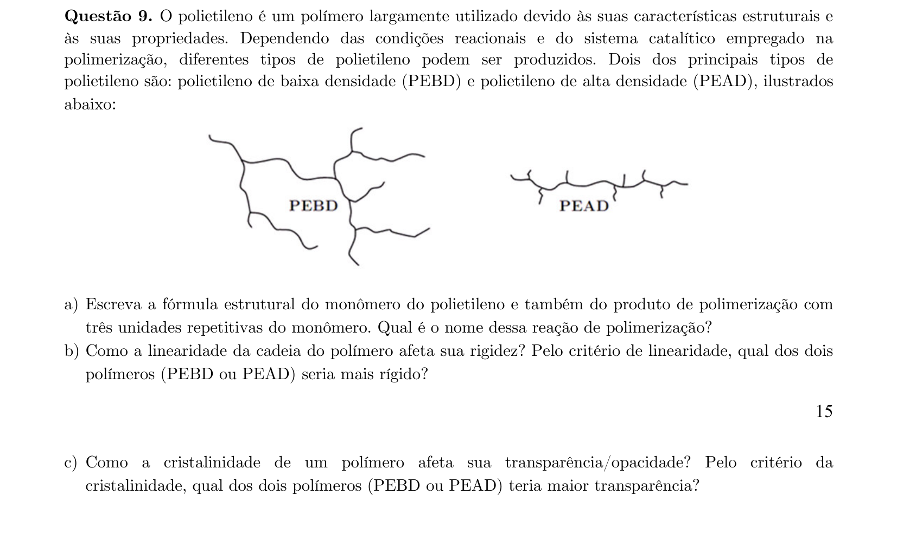
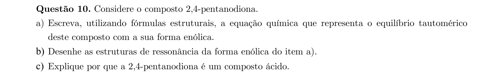

# Química — ITA 2021 (2ª fase)

> 10 questões discursivas.

## Q01
**Assunto:** eletroquímica
**Competências:** potenciais padrão de eletrodo, corrosão de metais, efeito do pH e da aeração
**Tipo:** discursiva

## Q02
**Assunto:** equilíbrio iônico
**Competências:** lei de Henry, ionização de ácidos, cálculo de pH de chuva ácida
**Tipo:** discursiva

## Q03
**Assunto:** cinética química
**Competências:** cinética de ordem zero, gases ideais, estequiometria de decomposição
**Tipo:** discursiva

## Q04
**Assunto:** termoquímica
**Competências:** poder calorífico superior e inferior, entalpia de vaporização, combustão
**Tipo:** discursiva

## Q05
**Assunto:** equilíbrio iônico
**Competências:** produto de solubilidade, equilíbrio de dissolução em meio ácido, ionização de H2S
**Tipo:** discursiva

## Q06
**Assunto:** estequiometria
**Competências:** combustão de alcenos, estequiometria de misturas gasosas, composição percentual
**Tipo:** discursiva

## Q07
**Assunto:** tabela periódica
**Competências:** afinidade eletrônica, energia de ionização, configuração eletrônica e periodicidade
**Tipo:** discursiva

## Q08
**Assunto:** eletroquímica
**Competências:** balanceamento de redox, potencial de reação, relação ΔH e ΔU
**Tipo:** discursiva

## Q09
**Assunto:** química orgânica
**Competências:** polímeros (PEBD/PEAD), polimerização do etileno, relação estrutura-propriedade
**Tipo:** discursiva

## Q10
**Assunto:** química orgânica
**Competências:** tautomeria ceto-enólica, ressonância, acidez de hidrogênios α
**Tipo:** discursiva

