# Química — ITA 2022 (1ª fase)

> 15 questões múltipla escolha.

## Q56
**Assunto:** soluções
**Competências:** soluções ideais, lei de Raoult, similaridade molecular entre solventes
**Tipo:** múltipla escolha

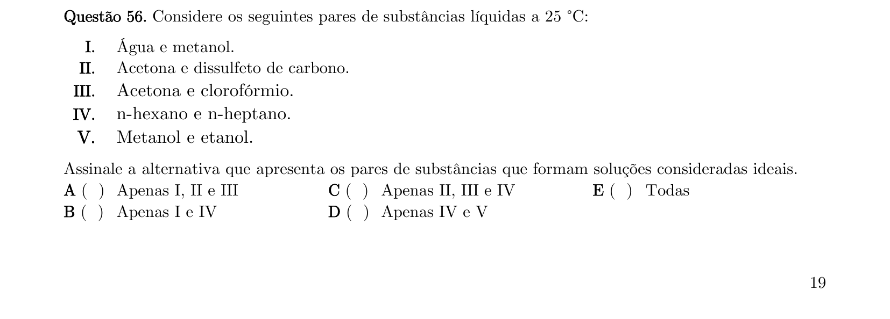

## Q57
**Assunto:** ligações químicas
**Competências:** energia reticular, ciclo de Born-Haber, sólido iônico
**Tipo:** múltipla escolha

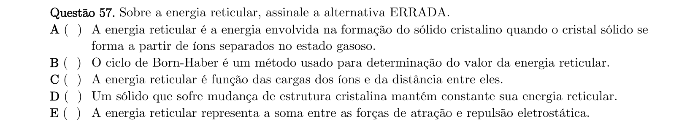

## Q58
**Assunto:** química nuclear
**Competências:** meia-vida, decaimento radioativo do ²³¹Pa, massa restante
**Tipo:** múltipla escolha

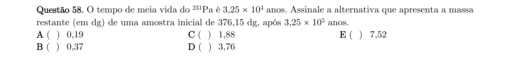

## Q59
**Assunto:** bioquímica
**Competências:** aminoácidos, estado iônico em pH fisiológico, polimerização, atividade óptica
**Tipo:** múltipla escolha

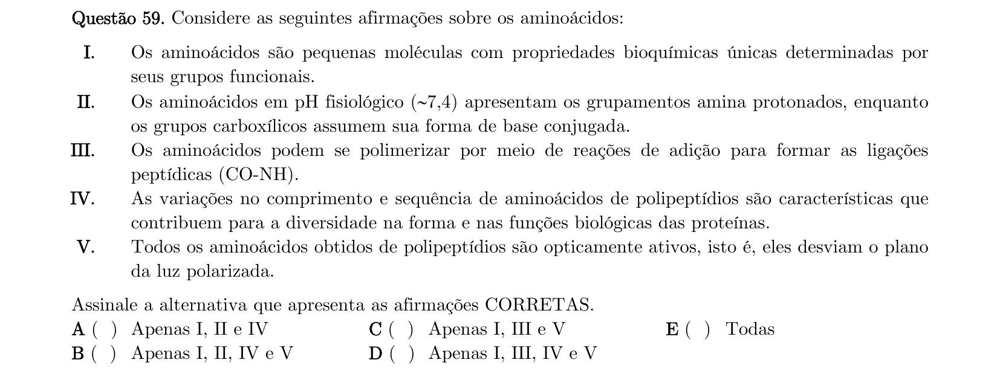

## Q60
**Assunto:** propriedades coligativas
**Competências:** ebulioscopia, identificação de soluto pela elevação do ponto de ebulição
**Tipo:** múltipla escolha

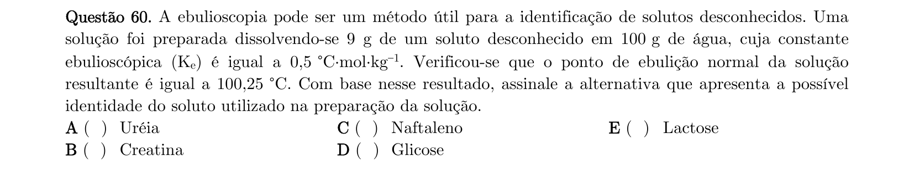

## Q61
**Assunto:** química ambiental
**Competências:** ciclo do oxigênio, produção e consumo na atmosfera, fontes aquáticas
**Tipo:** múltipla escolha

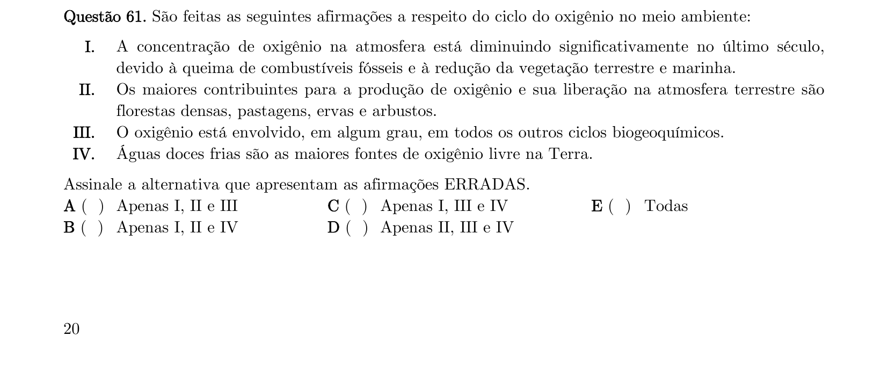

## Q62
**Assunto:** termoquímica
**Competências:** variação de entalpia, transição de fase de água em tensoativos, calor latente
**Tipo:** múltipla escolha

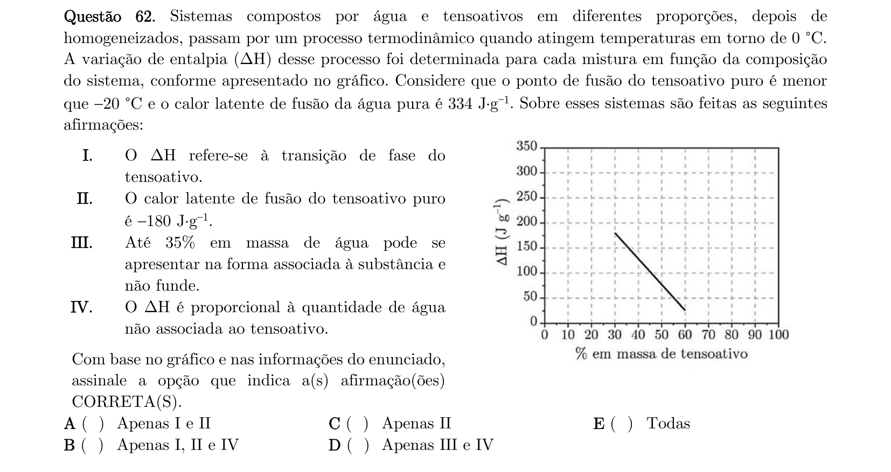

## Q63
**Assunto:** modelos atômicos
**Competências:** experimento de Rutherford, deflexão de partículas alfa, núcleo atômico
**Tipo:** múltipla escolha

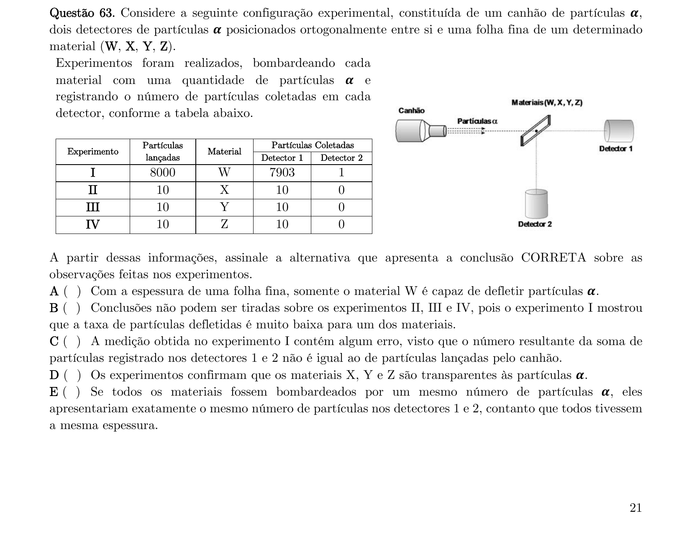

## Q64
**Assunto:** metodologia científica
**Competências:** ciclo do método científico hipotético-dedutivo, sequência de etapas
**Tipo:** múltipla escolha

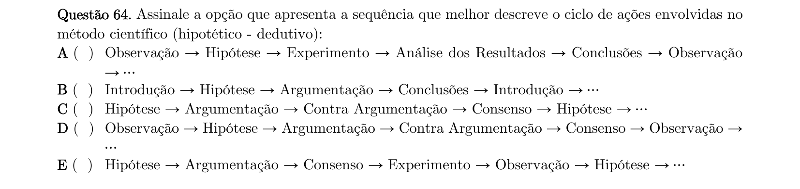

## Q65
**Assunto:** equilíbrio químico
**Competências:** princípio de Le Chatelier, efeito de temperatura, pressão e remoção de produtos
**Tipo:** múltipla escolha

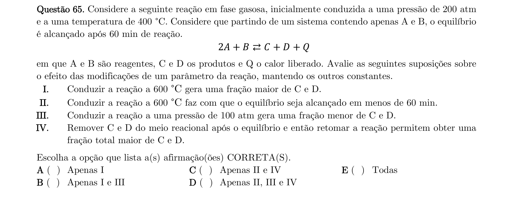

## Q66
**Assunto:** química orgânica
**Competências:** reações de substituição em aromáticos, efeitos diretores, nitração
**Tipo:** múltipla escolha

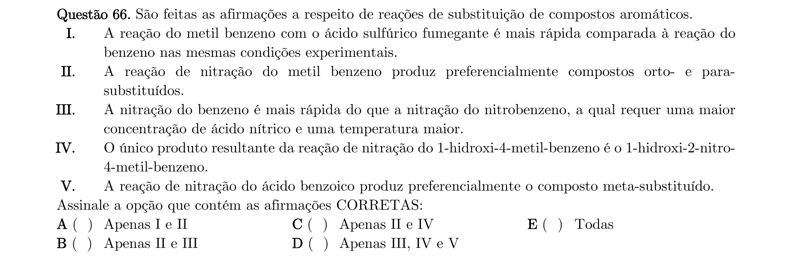

## Q67
**Assunto:** termodinâmica
**Competências:** processos termodinâmicos, função de estado, processo isotérmico, sistema isolado
**Tipo:** múltipla escolha

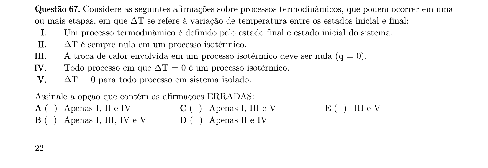

## Q68
**Assunto:** equilíbrio químico
**Competências:** dissociação de PCl5, constante kp, deslocamento por adição de reagente
**Tipo:** múltipla escolha

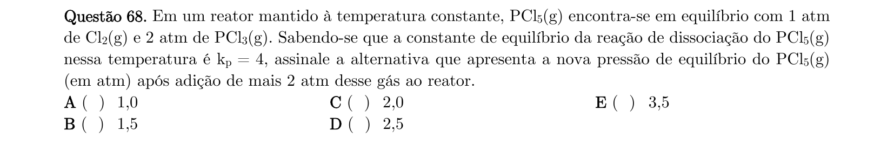

## Q69
**Assunto:** geometria molecular
**Competências:** teoria VSEPR, tricloretos, identificação de átomo central (N vs B)
**Tipo:** múltipla escolha

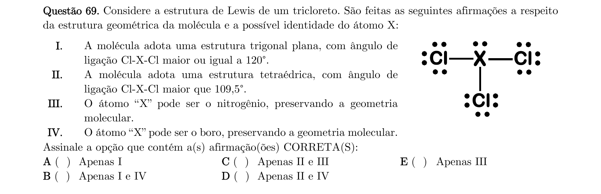

## Q70
**Assunto:** propriedades coligativas
**Competências:** pressão de vapor, abaixamento crioscópico, dimerização, pressão osmótica
**Tipo:** múltipla escolha

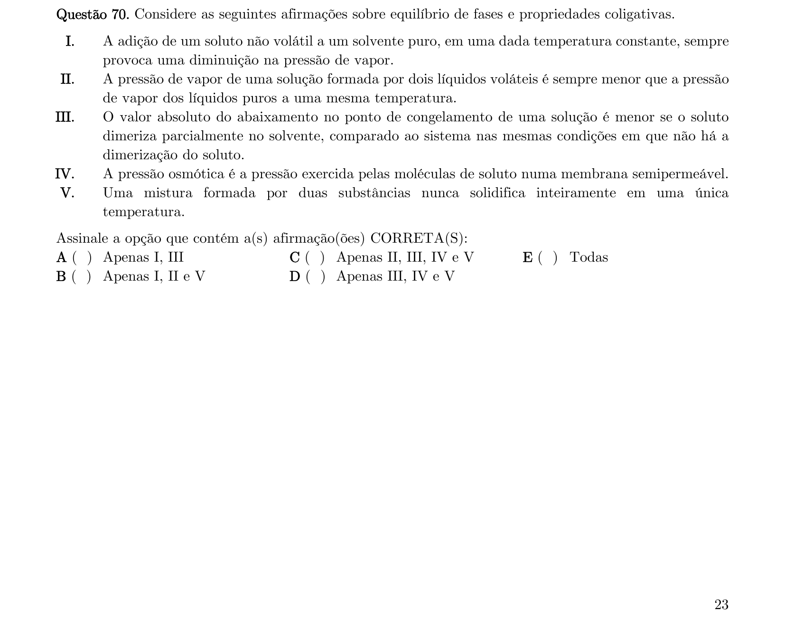
