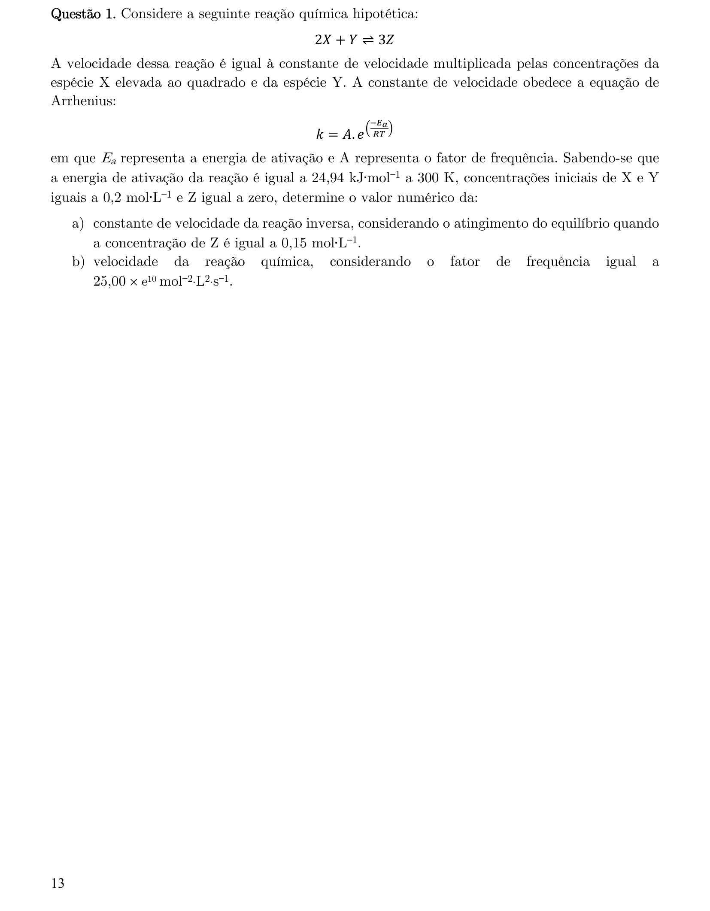
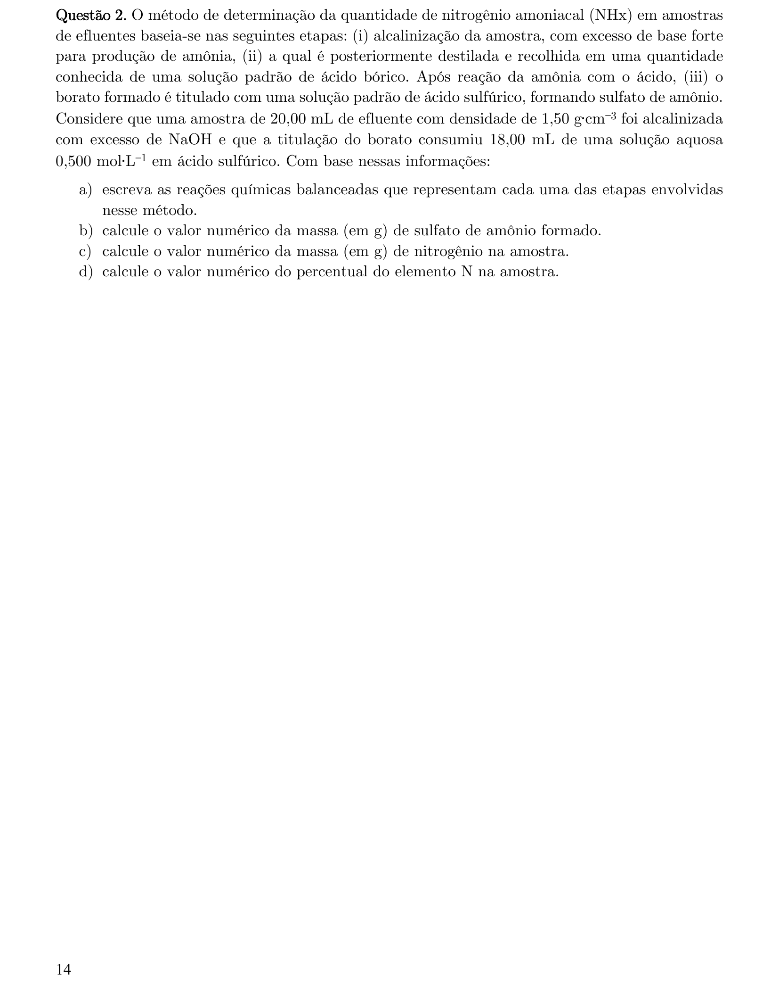
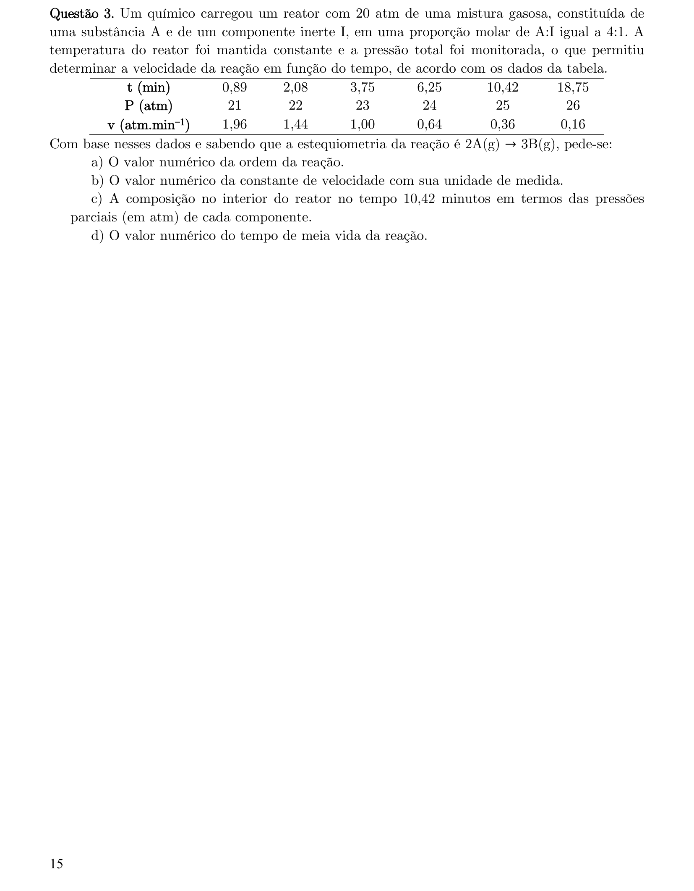
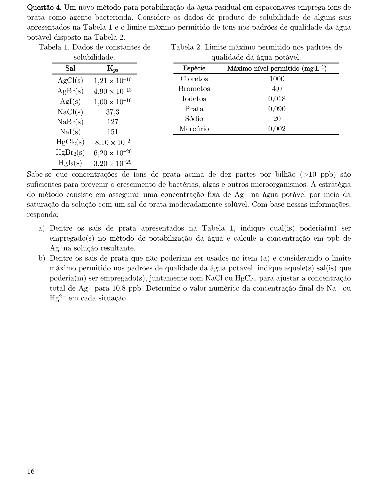
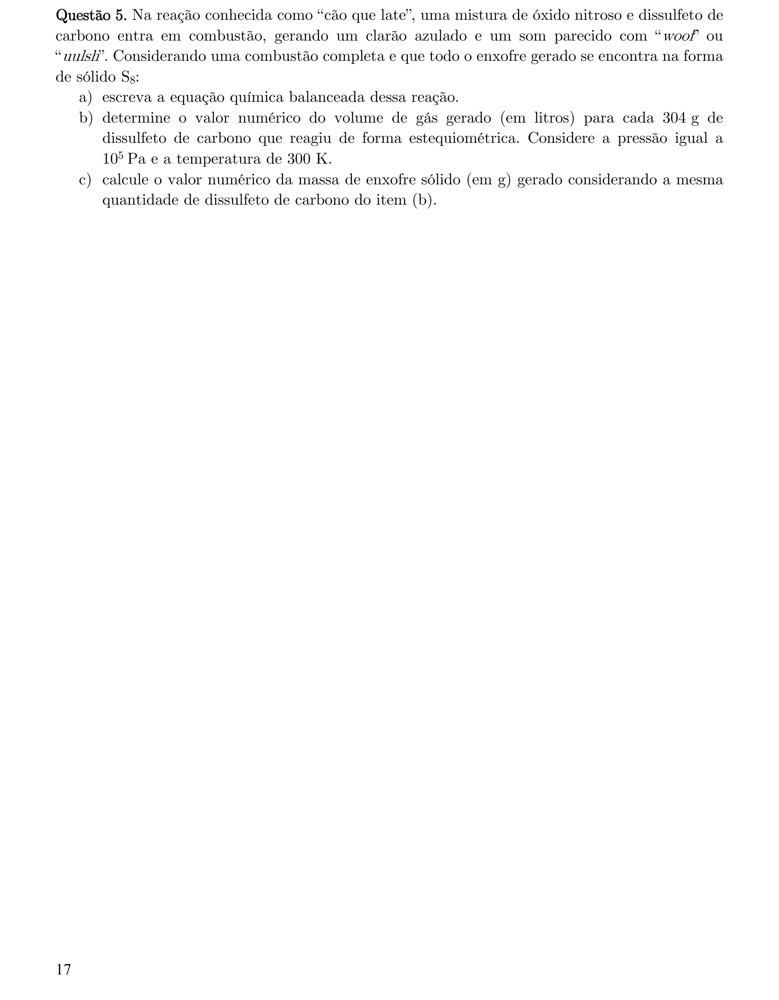
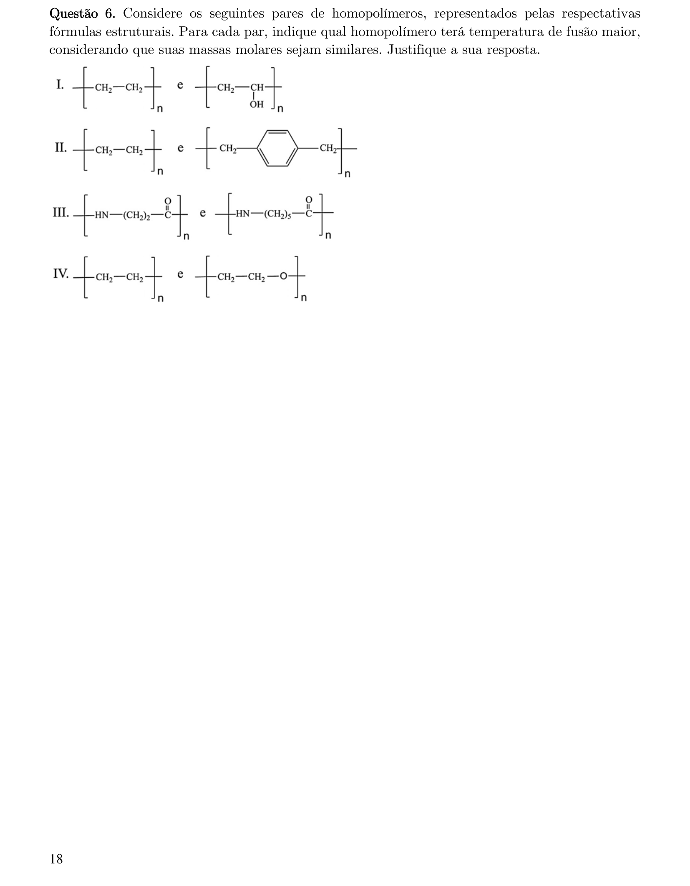
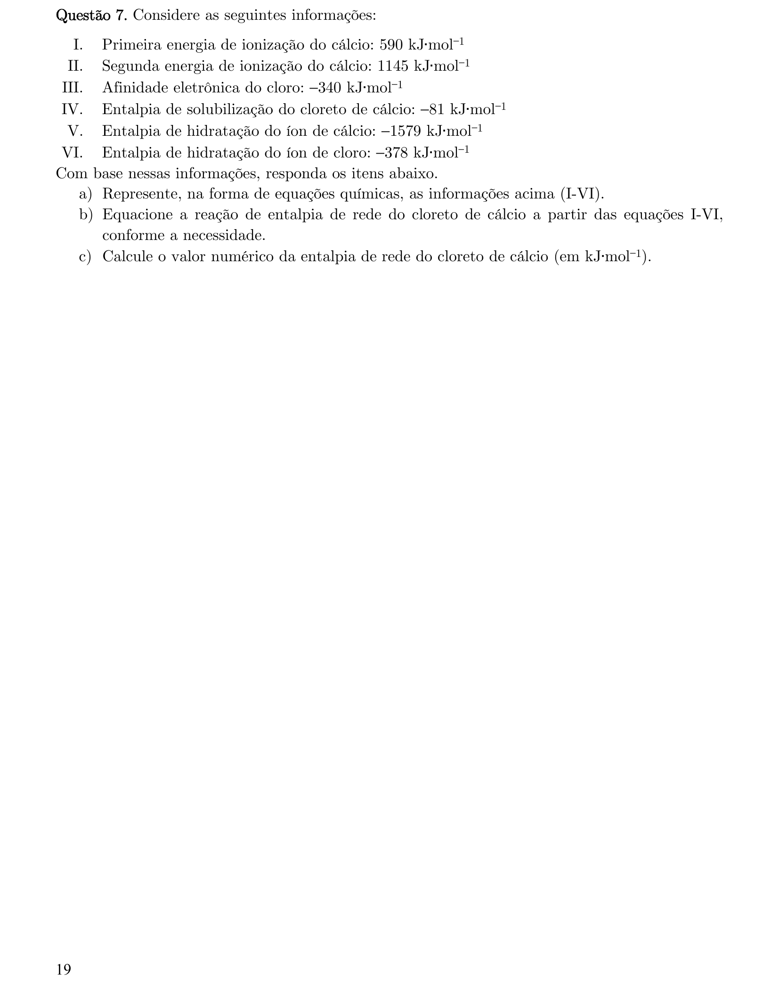
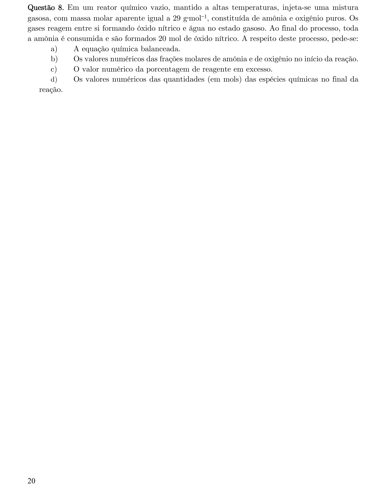
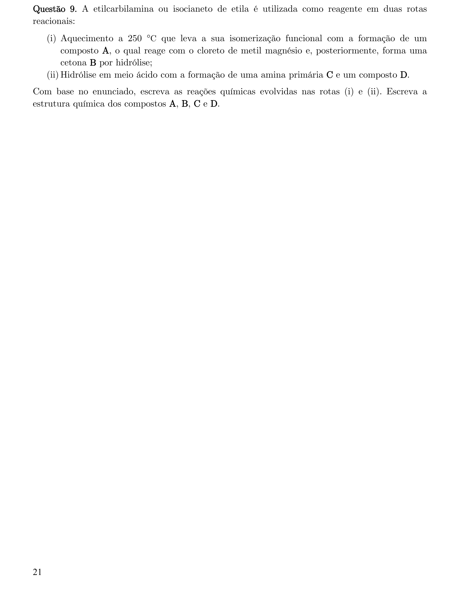
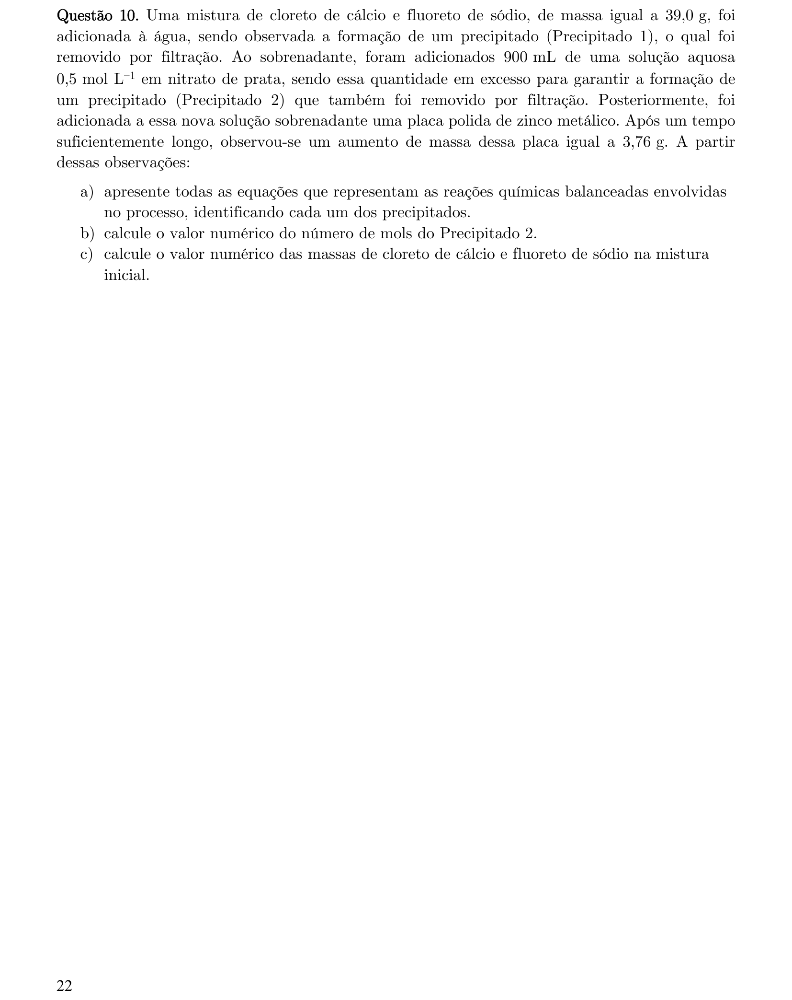

# Química — ITA 2022 (2ª fase)

> 10 questões discursivas.

## Q01
**Assunto:** cinética química
**Competências:** equação de Arrhenius, lei de velocidade, equilíbrio químico, cálculo de constante de velocidade inversa
**Tipo:** discursiva

## Q02
**Assunto:** química analítica
**Competências:** titulação ácido-base, estequiometria, reações ácido-base, cálculo de massa e percentual
**Tipo:** discursiva

## Q03
**Assunto:** cinética química
**Competências:** ordem de reação, constante de velocidade, pressões parciais, tempo de meia-vida
**Tipo:** discursiva

## Q04
**Assunto:** equilíbrio iônico
**Competências:** produto de solubilidade (Kps), conversão de unidades (ppb/mg·L⁻¹), solubilidade de sais
**Tipo:** discursiva

## Q05
**Assunto:** estequiometria
**Competências:** balanceamento de equações, gases ideais, cálculo de volume e massa
**Tipo:** discursiva

## Q06
**Assunto:** química orgânica
**Competências:** polímeros, interações intermoleculares, ligações de hidrogênio, temperatura de fusão
**Tipo:** discursiva

## Q07
**Assunto:** termoquímica
**Competências:** ciclo de Born-Haber, energia de ionização, afinidade eletrônica, entalpia de rede, lei de Hess
**Tipo:** discursiva

## Q08
**Assunto:** estequiometria
**Competências:** balanceamento de equações, massa molar aparente, fração molar, reagente em excesso, gases
**Tipo:** discursiva

## Q09
**Assunto:** química orgânica
**Competências:** isomeria funcional, reagente de Grignard, hidrólise de isocianetos, aminas, cetonas
**Tipo:** discursiva

## Q10
**Assunto:** reações inorgânicas
**Competências:** reações de precipitação, eletroquímica (deslocamento por Zn), estequiometria, sistema de equações
**Tipo:** discursiva

