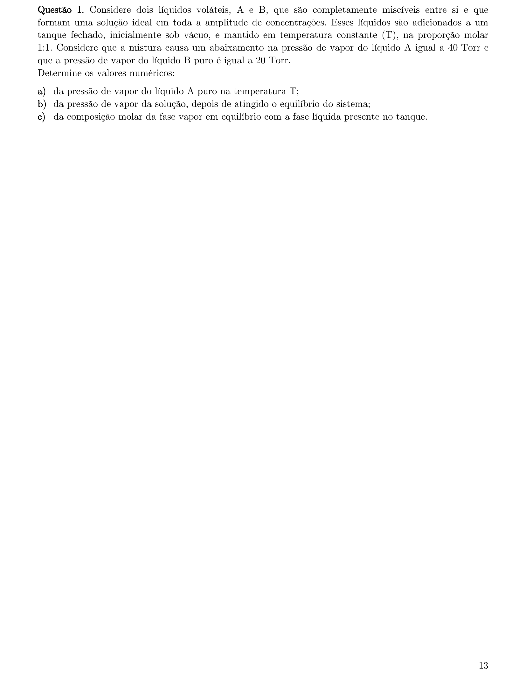
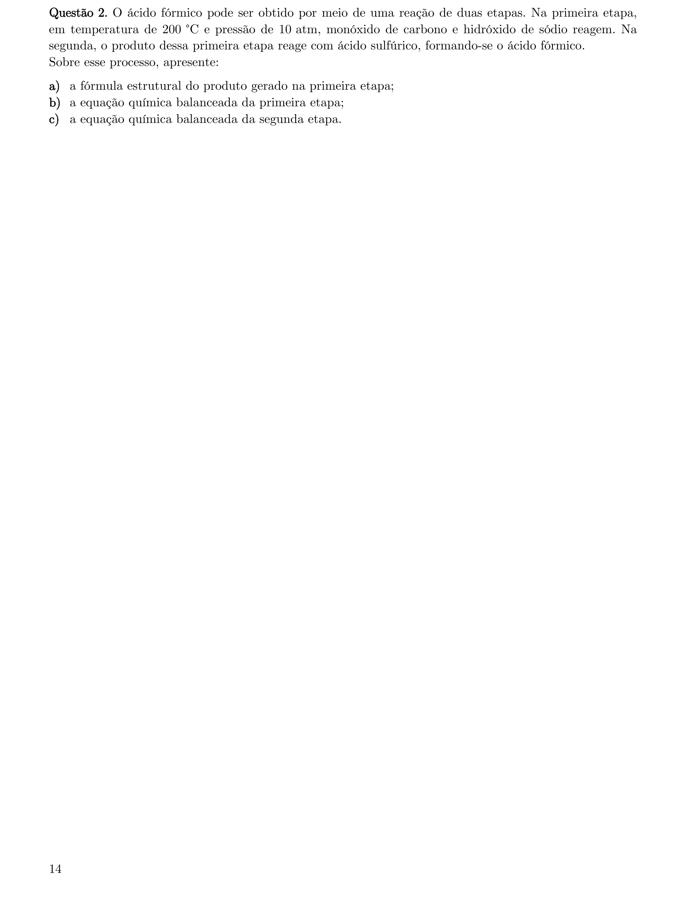
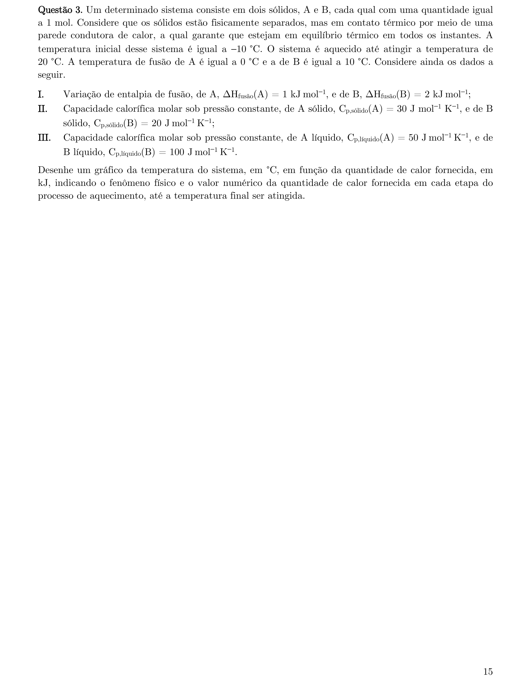
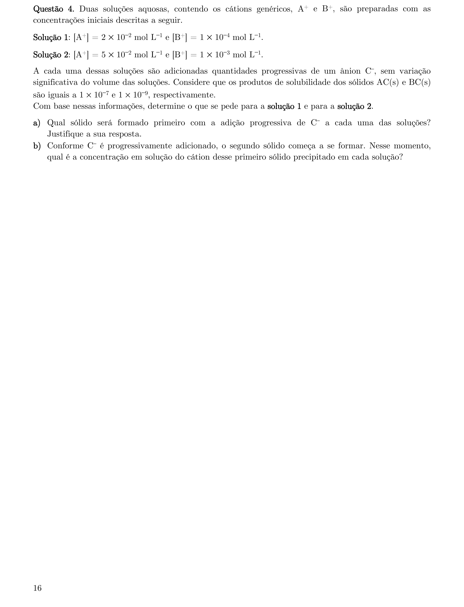
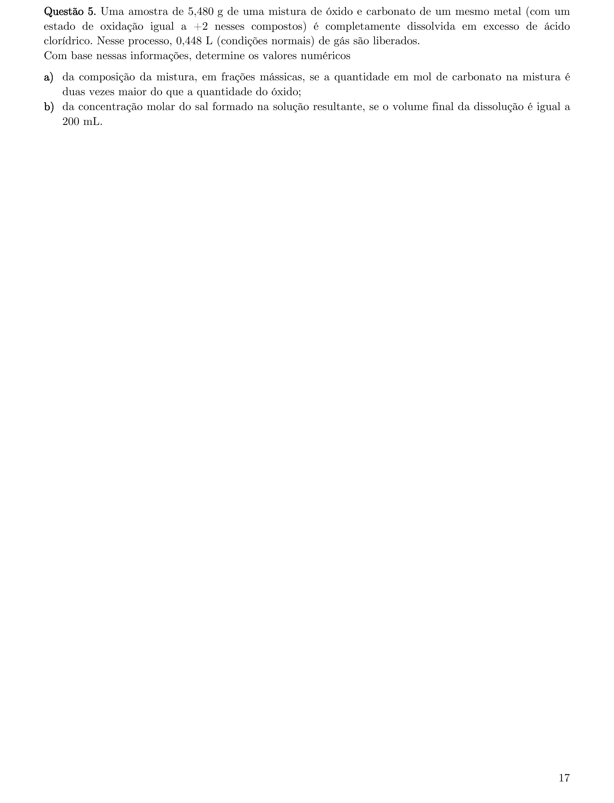
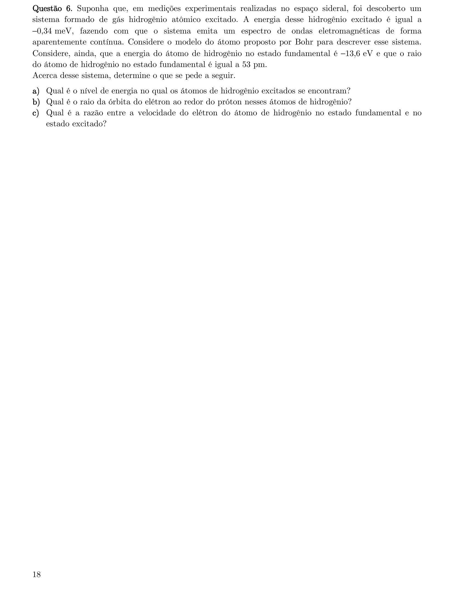
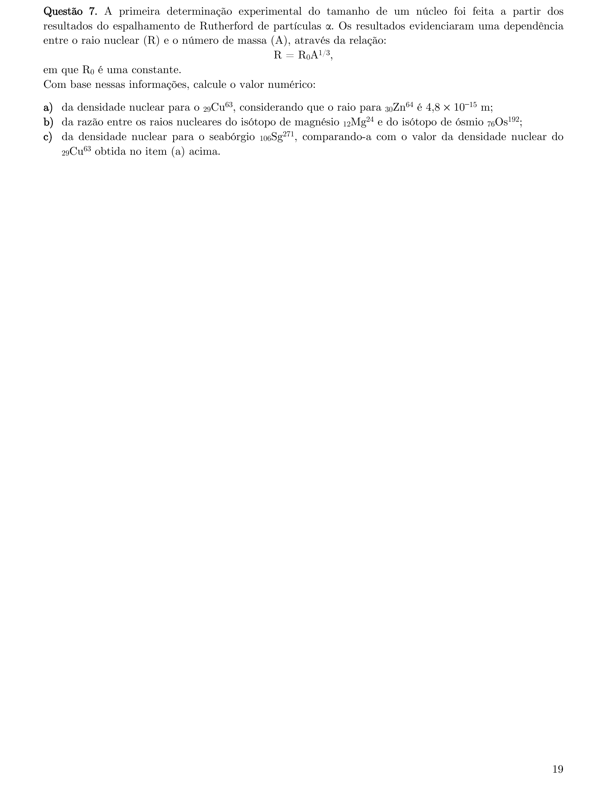
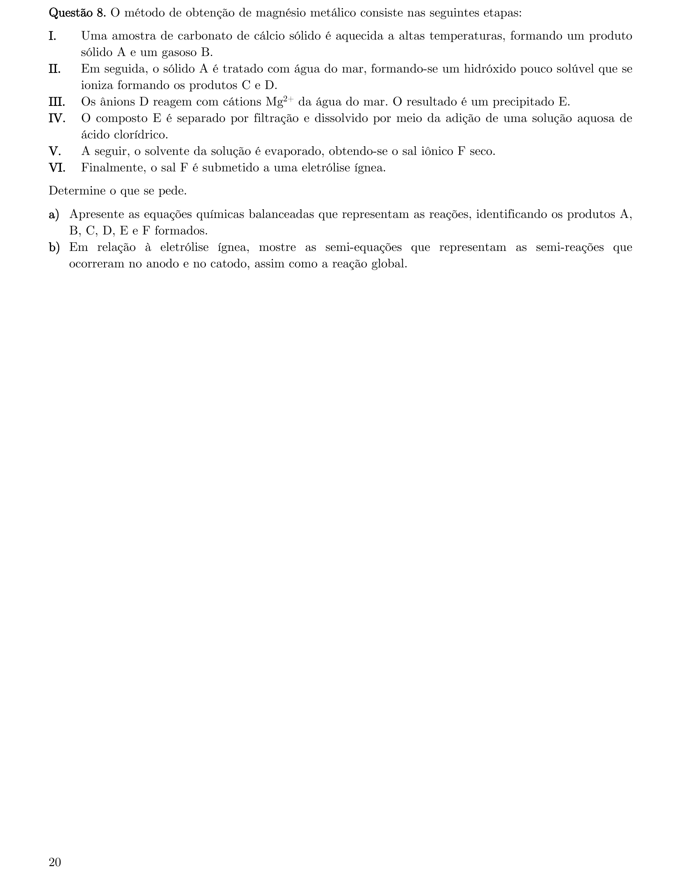
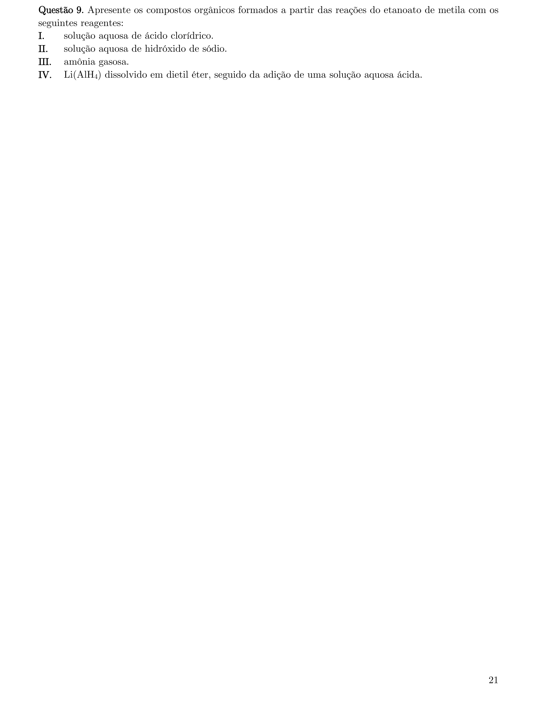
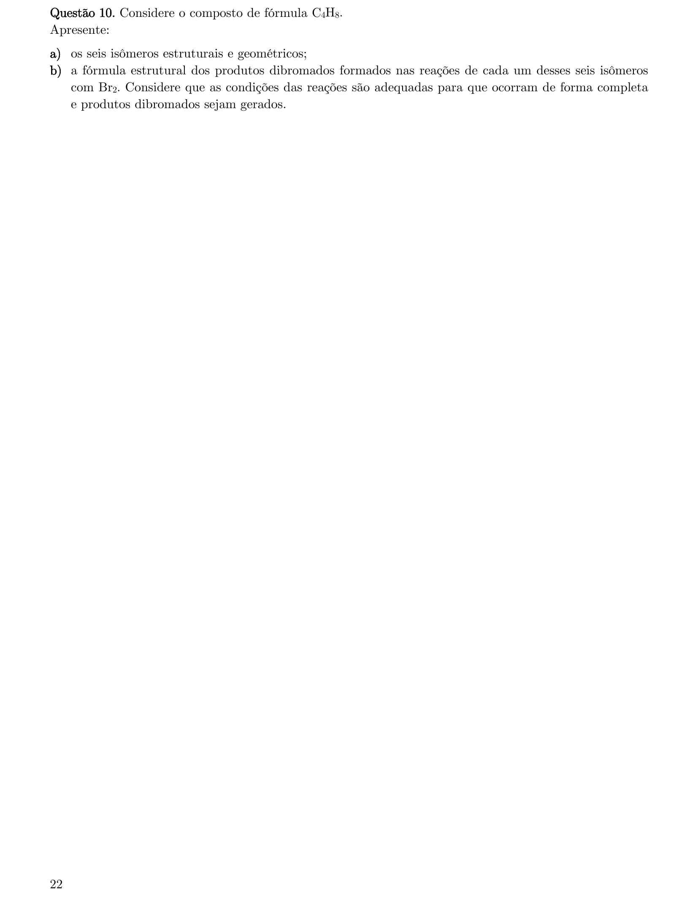

# Química — ITA 2023 (2ª fase)

> 10 questões discursivas.

## Q01
**Assunto:** propriedades coligativas
**Competências:** Lei de Raoult, pressão de vapor, solução ideal, composição da fase vapor, fração molar
**Tipo:** discursiva

## Q02
**Assunto:** química orgânica
**Competências:** síntese do ácido fórmico, reação CO + NaOH, formato de sódio, equações balanceadas, fórmula estrutural
**Tipo:** discursiva

## Q03
**Assunto:** termoquímica
**Competências:** calor sensível, calor latente de fusão, capacidade calorífica, gráfico T vs Q, mudança de fase
**Tipo:** discursiva

## Q04
**Assunto:** equilíbrio iônico
**Competências:** produto de solubilidade (Kps), precipitação fracionada, condição de precipitação, concentração residual
**Tipo:** discursiva

## Q05
**Assunto:** estequiometria
**Competências:** mistura óxido/carbonato, reação com HCl, volume molar nas CNTP, fração mássica, concentração molar
**Tipo:** discursiva

## Q06
**Assunto:** atomística
**Competências:** modelo de Bohr, níveis de energia, raio orbital, velocidade do elétron, quantização
**Tipo:** discursiva

## Q07
**Assunto:** radioatividade
**Competências:** raio nuclear, número de massa, densidade nuclear, isótopos, modelo de Rutherford
**Tipo:** discursiva

## Q08
**Assunto:** reações inorgânicas
**Competências:** obtenção do magnésio, calcinação do CaCO3, precipitação Mg(OH)2, eletrólise ígnea, semi-reações
**Tipo:** discursiva

## Q09
**Assunto:** química orgânica
**Competências:** ésteres, hidrólise ácida, hidrólise básica (saponificação), amonólise, redução com LiAlH4
**Tipo:** discursiva

## Q10
**Assunto:** química orgânica
**Competências:** isomeria estrutural, isomeria geométrica cis/trans, C4H8, adição eletrofílica de Br2, ciclanos
**Tipo:** discursiva

