# Química — ITA 2024 (1ª fase)

> 12 questões múltipla escolha (Q49–Q60 da prova consolidada).

## Q49
**Assunto:** estequiometria, termoquímica
**Competências:** combustão completa, misturas estequiométricas, composição percentual, entalpia
**Tipo:** múltipla escolha (asserções I-IV)

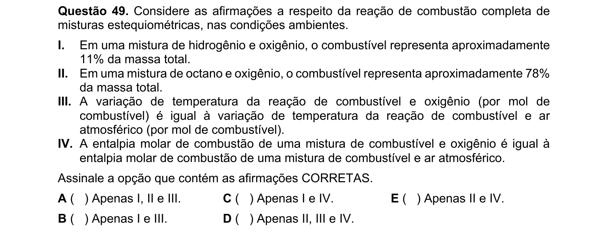

## Q50
**Assunto:** química ambiental — ciclo do nitrogênio
**Competências:** fixação, nitrificação, desnitrificação, amonificação
**Tipo:** múltipla escolha (asserções I-V)

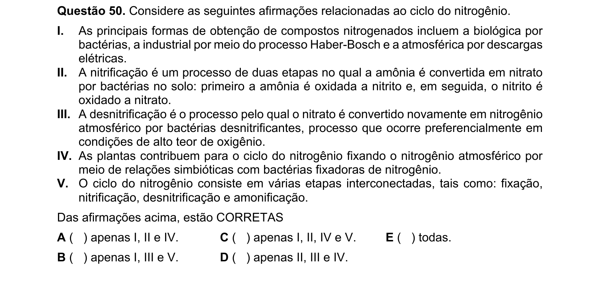

## Q51
**Assunto:** termoquímica
**Competências:** identificação de processo endotérmico, entalpia de reação
**Tipo:** múltipla escolha

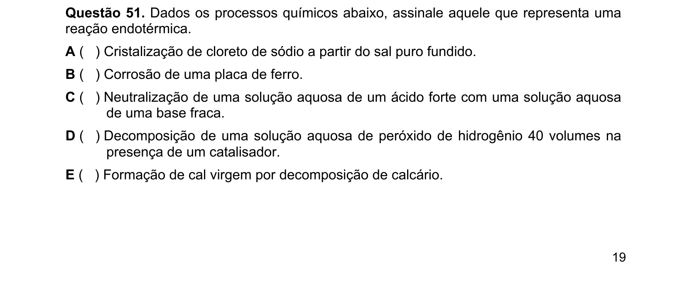

## Q52
**Assunto:** modelos atômicos
**Competências:** Bohr, Dalton, Rutherford, Thomson; identificação do modelo mínimo necessário
**Tipo:** múltipla escolha (asserções I-IV)

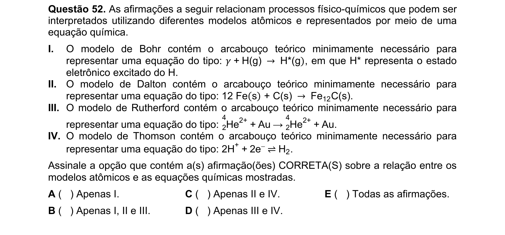

## Q53
**Assunto:** misturas e separação
**Competências:** azeótropos, ligas metálicas, filtração à pressão reduzida, curva de aquecimento
**Tipo:** múltipla escolha (asserções I-IV)

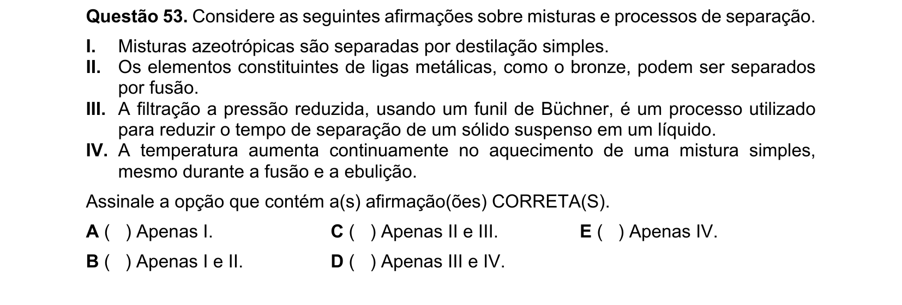

## Q54
**Assunto:** química orgânica — acidez
**Competências:** comparação de pKa de ácidos carboxílicos, efeito indutivo, halogênios
**Tipo:** múltipla escolha (asserções I-IV)

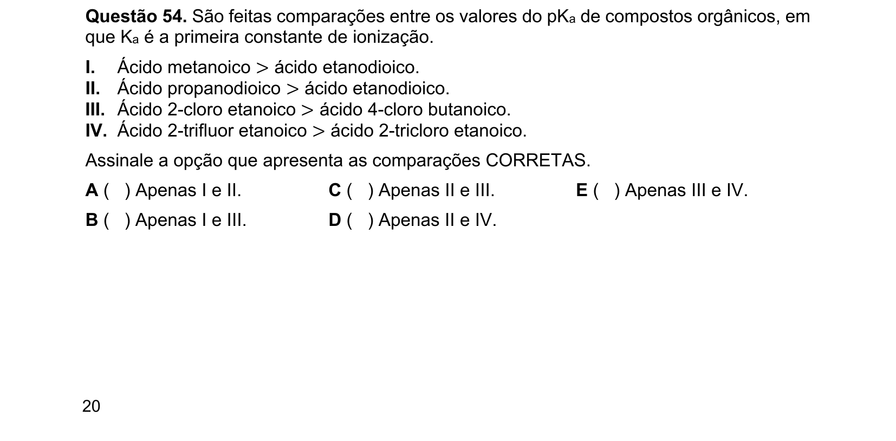

## Q55
**Assunto:** química inorgânica — halogênios
**Competências:** reatividade dos halogênios, reações de deslocamento, série eletroquímica
**Tipo:** múltipla escolha (asserções I-V)

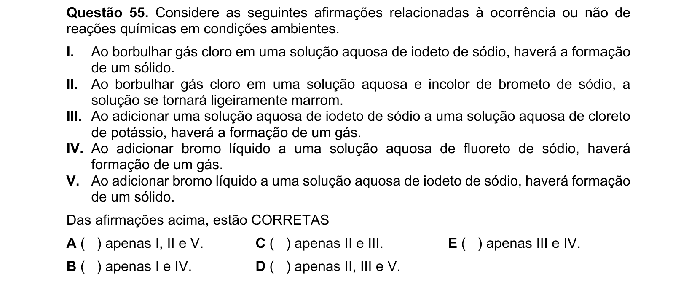

## Q56
**Assunto:** equilíbrio iônico
**Competências:** solução tampão, pH, base forte adicionada a tampão, Henderson-Hasselbalch
**Tipo:** múltipla escolha

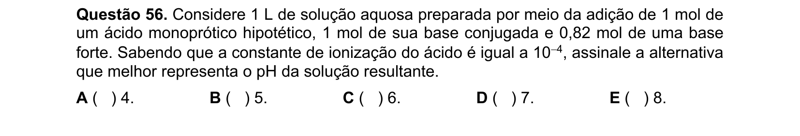

## Q57
**Assunto:** química orgânica — reatividade
**Competências:** esterificação (efeito estérico), oxidação de alcinos, redução de fenol
**Tipo:** múltipla escolha (asserções I-III)

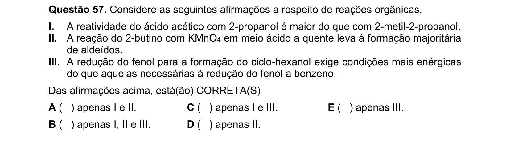

## Q58
**Assunto:** propriedades coligativas
**Competências:** ebulioscopia, equilíbrio de dissociação, fator de van't Hoff implícito
**Tipo:** múltipla escolha

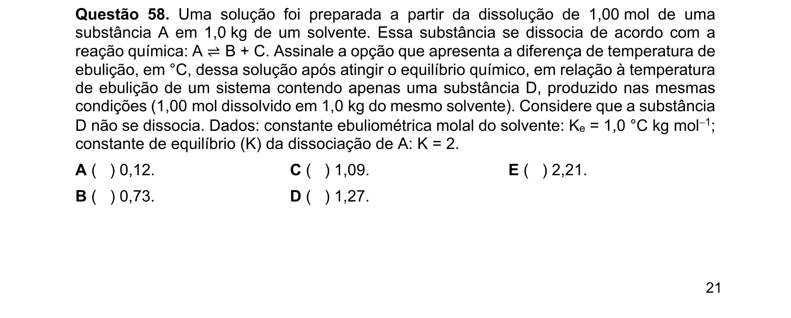

## Q59
**Assunto:** eletroquímica
**Competências:** potencial padrão, energia livre de Gibbs, eletrodo de calomelano, célula galvânica vs eletrolítica
**Tipo:** múltipla escolha (asserções I-IV)

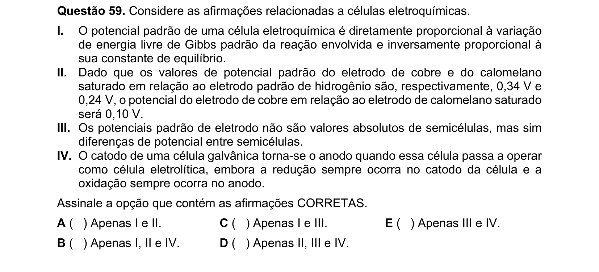

## Q60
**Assunto:** termoquímica
**Competências:** entalpia de formação a partir de energias de ligação, lei de Hess
**Tipo:** múltipla escolha

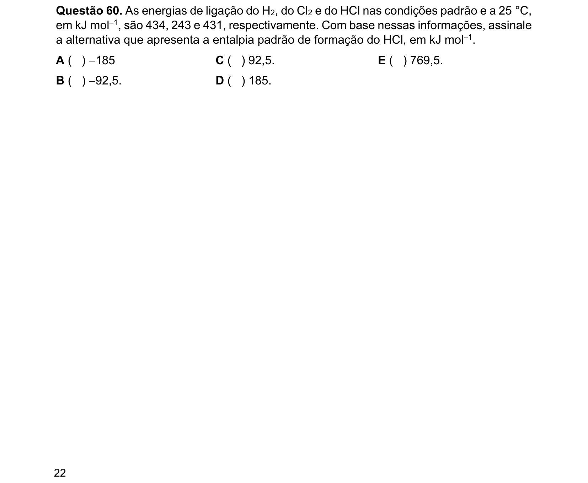
