# Química — ITA 2025 (1ª fase)

> 12 questões múltipla escolha (Q25–Q36 da prova consolidada MAT+FIS+QUI+ING).

## Q25
**Assunto:** físico-química / combustão
**Competências:** propagação de chama, detonação, catálise, asserções I-IV
**Tipo:** múltipla escolha (asserções I-IV)

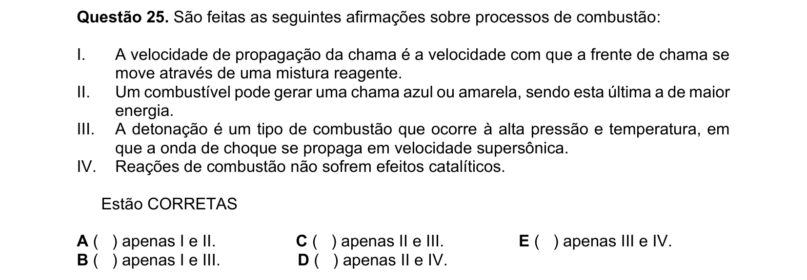

## Q26
**Assunto:** química orgânica
**Competências:** oxidação de alquenos com KMnO4, isomeria cis/trans, produtos majoritários, asserções I-IV
**Tipo:** múltipla escolha (asserções I-IV)

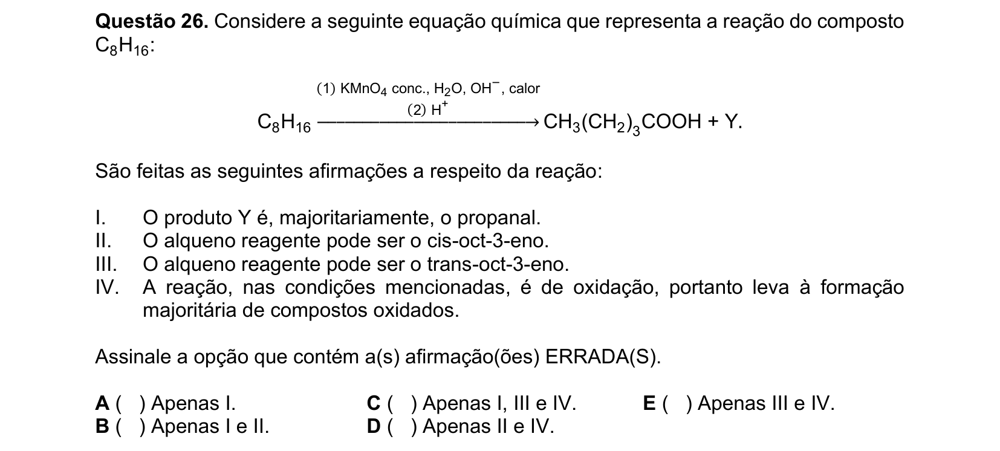

## Q27
**Assunto:** propriedades periódicas
**Competências:** afinidade eletrônica de gases nobres, raio iônico, energia de ionização, raio atômico, asserções I-IV
**Tipo:** múltipla escolha (asserções I-IV)

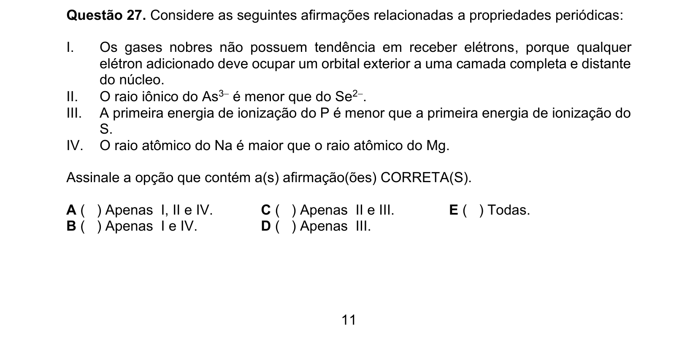

## Q28
**Assunto:** gases ideais
**Competências:** equação de Clapeyron, transformações combinadas, P-V-T
**Tipo:** múltipla escolha

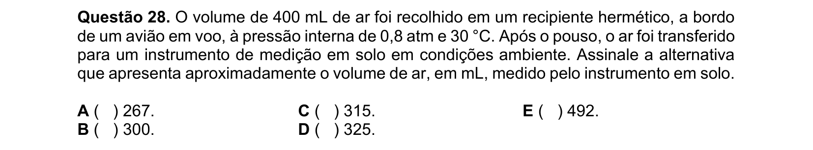

## Q29
**Assunto:** estequiometria / titulação
**Competências:** titulação de retorno, oxirredução, agente oxidante/redutor, asserções I-IV
**Tipo:** múltipla escolha (asserções I-IV)

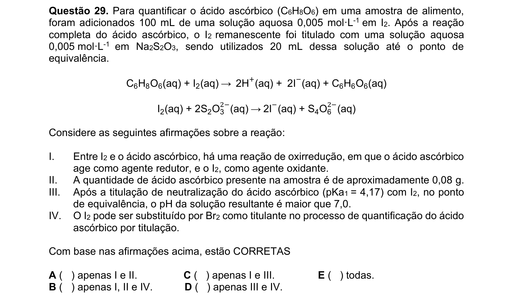

## Q30
**Assunto:** termoquímica
**Competências:** energia de Gibbs, entalpia e entropia padrão, temperatura mínima de espontaneidade
**Tipo:** múltipla escolha

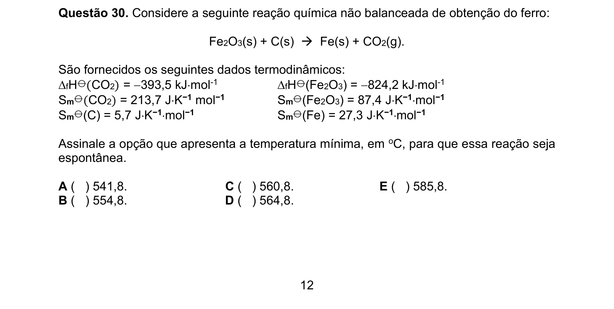

## Q31
**Assunto:** cinética química
**Competências:** equação de Arrhenius, energia de ativação, razão entre constantes de velocidade
**Tipo:** múltipla escolha

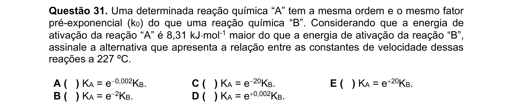

## Q32
**Assunto:** geometria molecular / polaridade
**Competências:** PCl5, bipirâmide trigonal, substituição de halogênios, isômeros polares/apolares
**Tipo:** múltipla escolha

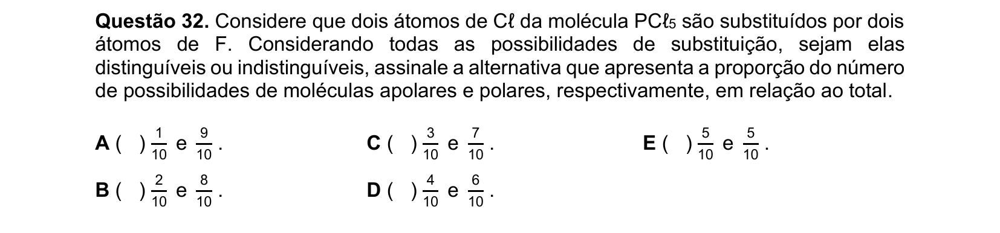

## Q33
**Assunto:** química geral / laboratório
**Competências:** recristalização, solubilidade, purificação de sais, filtração a quente
**Tipo:** múltipla escolha

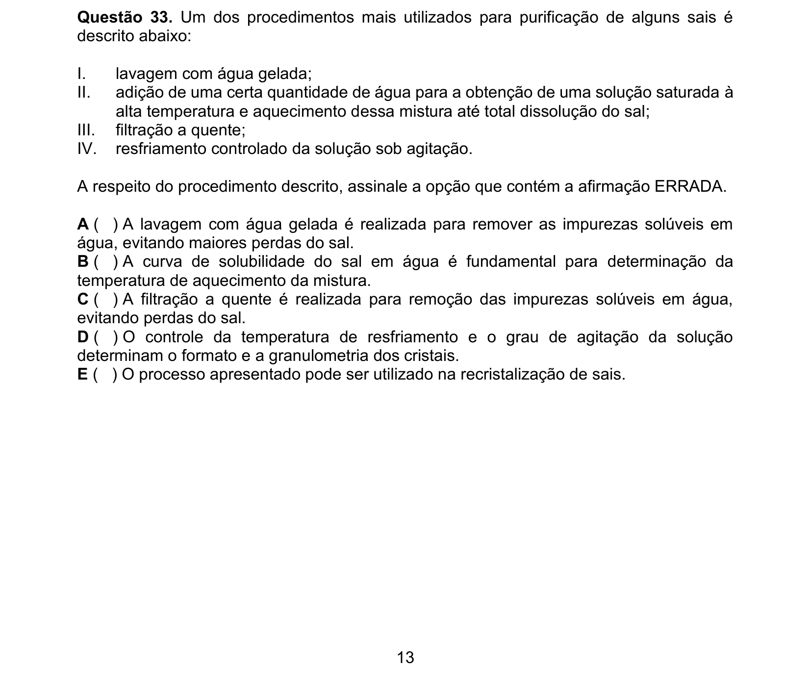

## Q34
**Assunto:** termodinâmica
**Competências:** expansão isotérmica, energia de Gibbs, entalpia em processo isobárico, entropia
**Tipo:** múltipla escolha

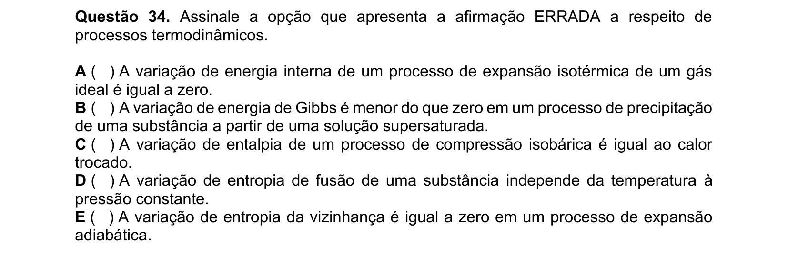

## Q35
**Assunto:** química orgânica / oxirredução
**Competências:** número de oxidação de carbono em diferentes funções orgânicas
**Tipo:** múltipla escolha

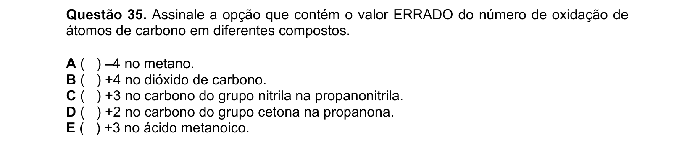

## Q36
**Assunto:** fotoquímica
**Competências:** energia do fóton, relação E=hc/λ, espectro eletromagnético
**Tipo:** múltipla escolha

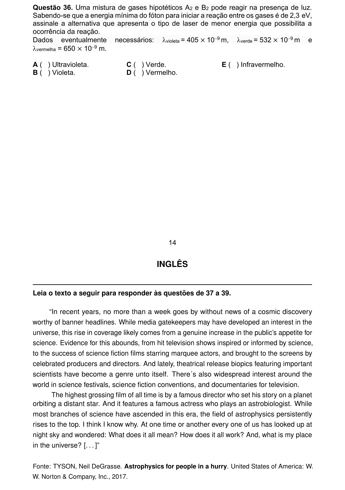
