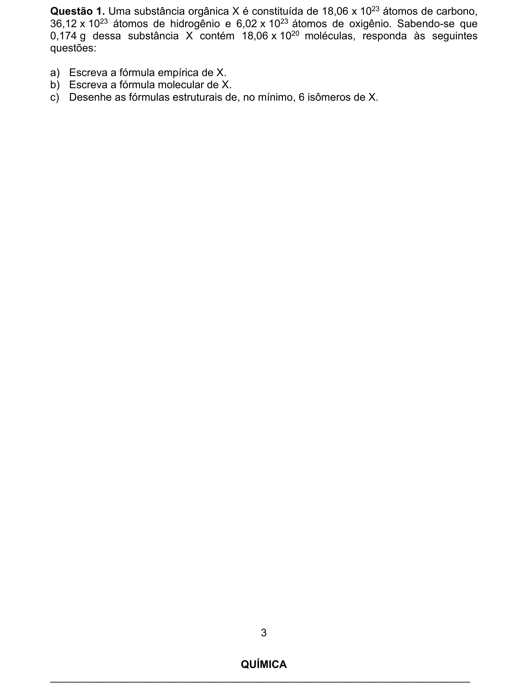
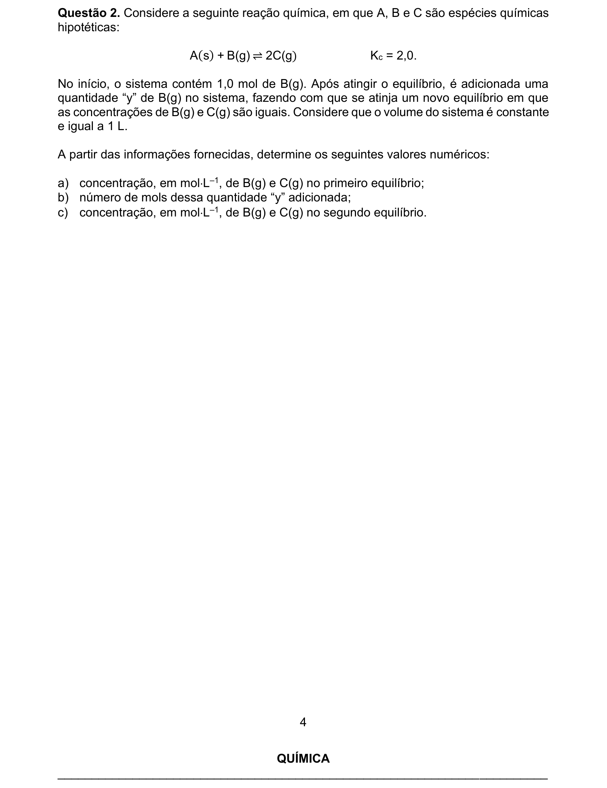
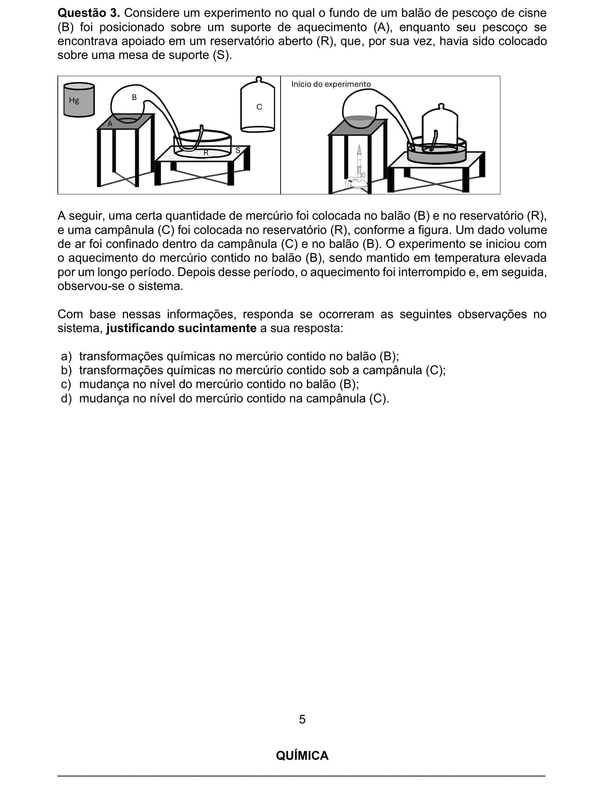
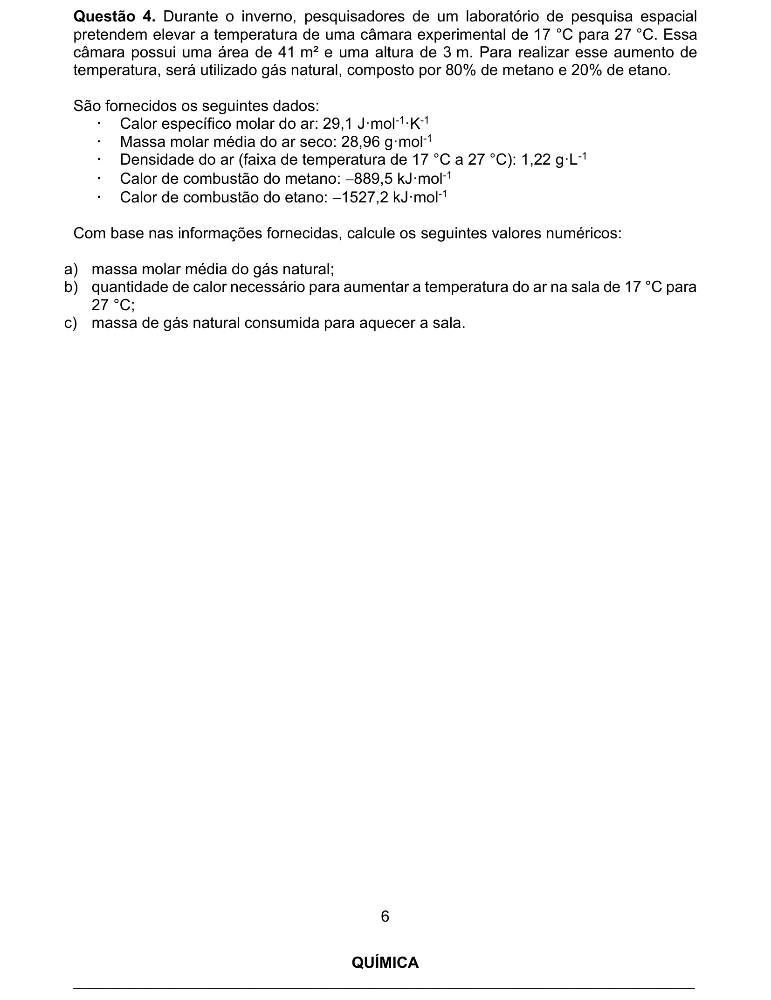
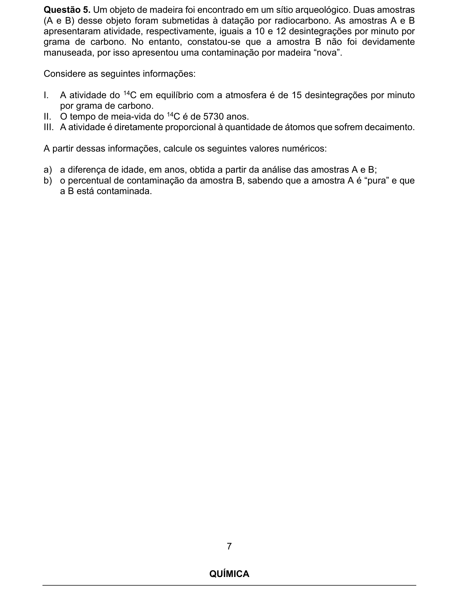
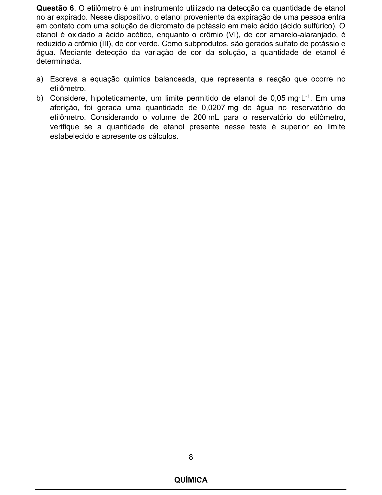
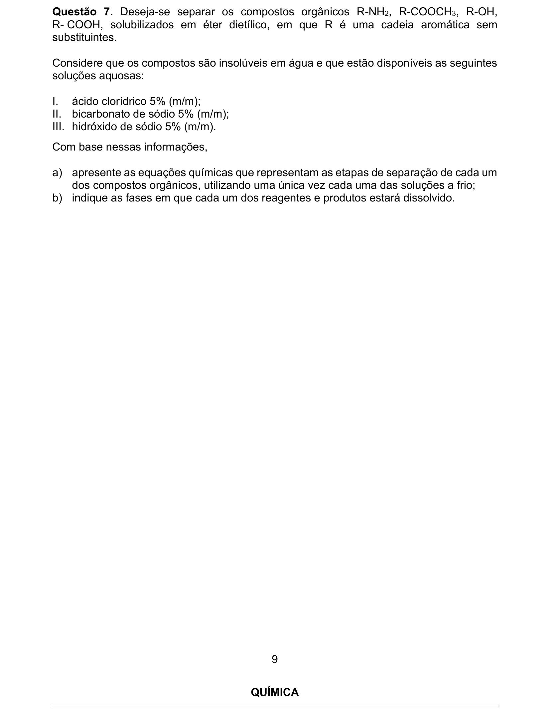
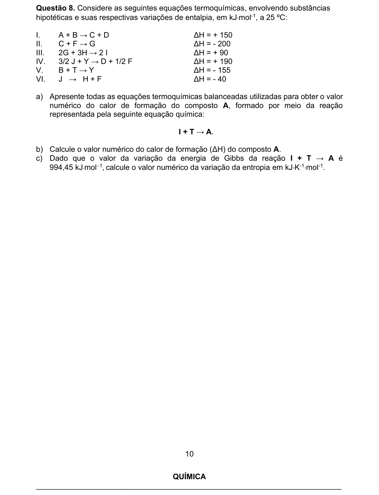
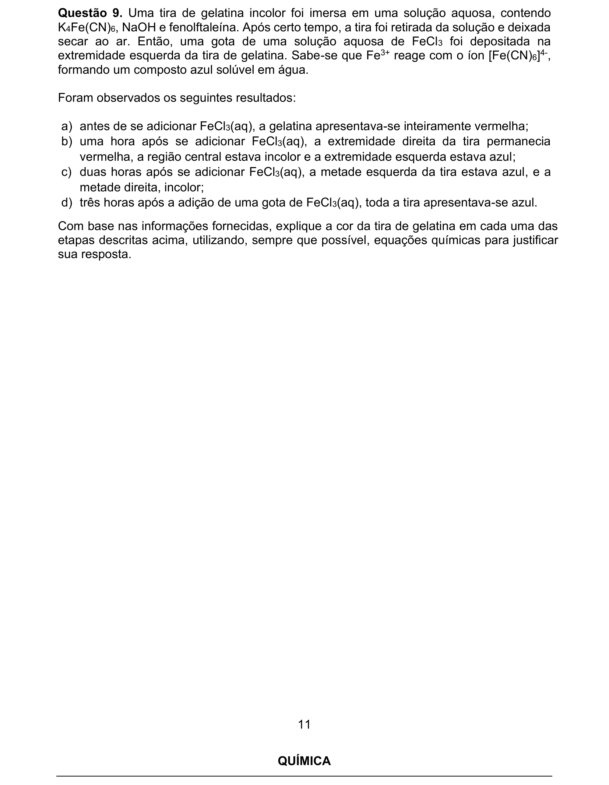
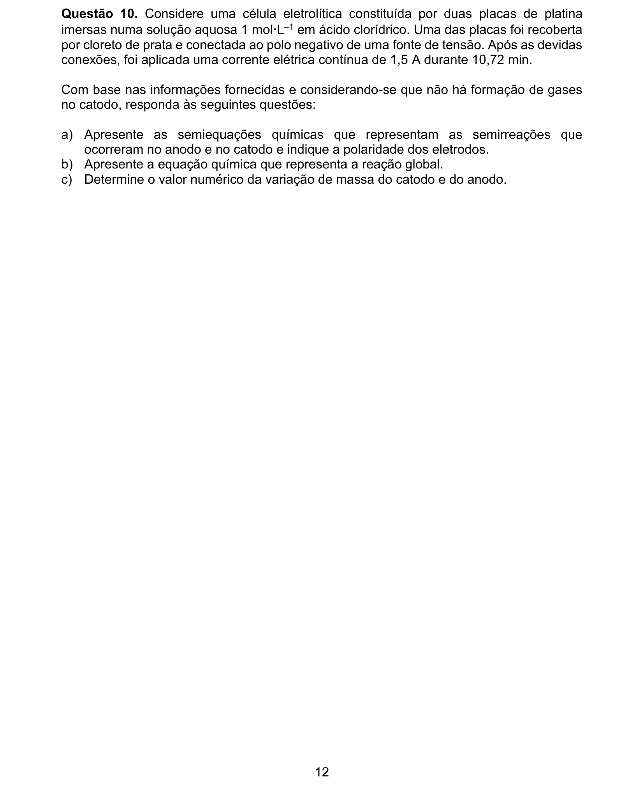

# Química — ITA 2025 (2ª fase)

> 10 questões discursivas.

## Q01
**Assunto:** química orgânica
**Competências:** fórmula empírica, fórmula molecular, isomeria, mol, contagem de átomos
**Tipo:** discursiva

## Q02
**Assunto:** equilíbrio químico
**Competências:** constante de equilíbrio Kc, perturbação do equilíbrio, princípio de Le Chatelier, estequiometria de reação
**Tipo:** discursiva

## Q03
**Assunto:** reações inorgânicas
**Competências:** oxidação do mercúrio, experimento de Lavoisier, conservação da massa, gases
**Tipo:** discursiva

## Q04
**Assunto:** termoquímica
**Competências:** calor de combustão, capacidade calorífica, massa molar média, estequiometria de combustão, gases
**Tipo:** discursiva

## Q05
**Assunto:** radioatividade
**Competências:** datação por carbono-14, meia-vida, cinética de decaimento, cálculo de contaminação
**Tipo:** discursiva

## Q06
**Assunto:** reações inorgânicas
**Competências:** oxirredução, balanceamento, dicromato/Cr(VI)→Cr(III), estequiometria
**Tipo:** discursiva

## Q07
**Assunto:** química orgânica
**Competências:** funções orgânicas (amina, éster, fenol, ácido carboxílico), reações ácido-base, extração líquido-líquido, solubilidade
**Tipo:** discursiva

## Q08
**Assunto:** termoquímica
**Competências:** lei de Hess, entalpia de formação, energia livre de Gibbs, entropia
**Tipo:** discursiva

## Q09
**Assunto:** reações inorgânicas
**Competências:** identificação de íons, complexo azul da Prússia, indicadores ácido-base, difusão em gel
**Tipo:** discursiva

## Q10
**Assunto:** eletroquímica
**Competências:** eletrólise, leis de Faraday, semirreações, anodo/catodo, estequiometria eletroquímica
**Tipo:** discursiva

