# Química — ITA 2026 (1ª fase)

> 12 questões múltipla escolha (Q25–Q36 da prova consolidada MAT+FIS+QUI+ING).

## Q01
**Assunto:** cinética química
**Competências:** catalisador, energia de ativação, Arrhenius, tempo de reação
**Tipo:** múltipla escolha

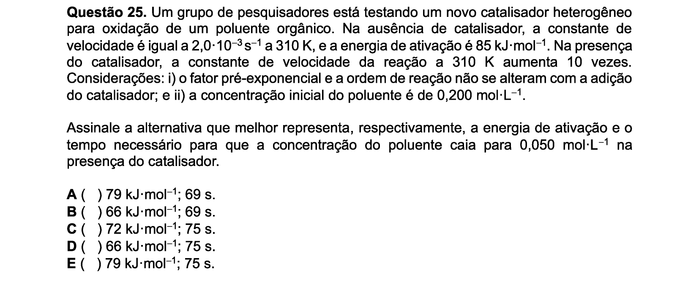

## Q02
**Assunto:** propriedades periódicas / ligações
**Competências:** energia de ionização, raio iônico, geometria molecular, polaridade, asserções I-IV
**Tipo:** múltipla escolha (asserções I-IV)

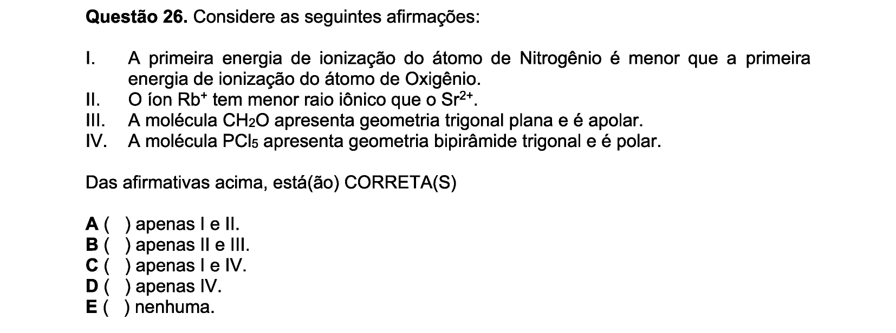

## Q03
**Assunto:** termoquímica / calorimetria
**Competências:** calor específico, equilíbrio térmico, sistemas com múltiplos corpos
**Tipo:** múltipla escolha

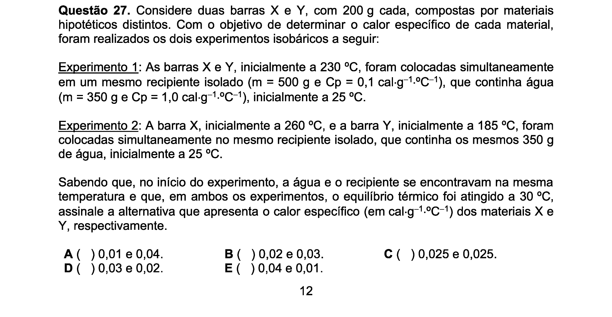

## Q04
**Assunto:** química ambiental
**Competências:** efeito estufa, gases de efeito estufa, CFCs, camada de ozônio, asserções I-IV
**Tipo:** múltipla escolha (asserções I-IV)

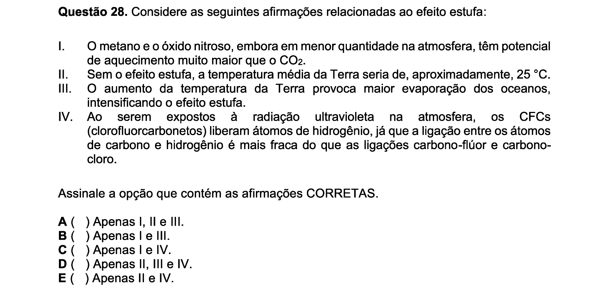

## Q05
**Assunto:** eletroquímica
**Competências:** célula galvânica, potenciais de eletrodo, corrosão, semirreações, asserções I-IV
**Tipo:** múltipla escolha (asserções I-IV)

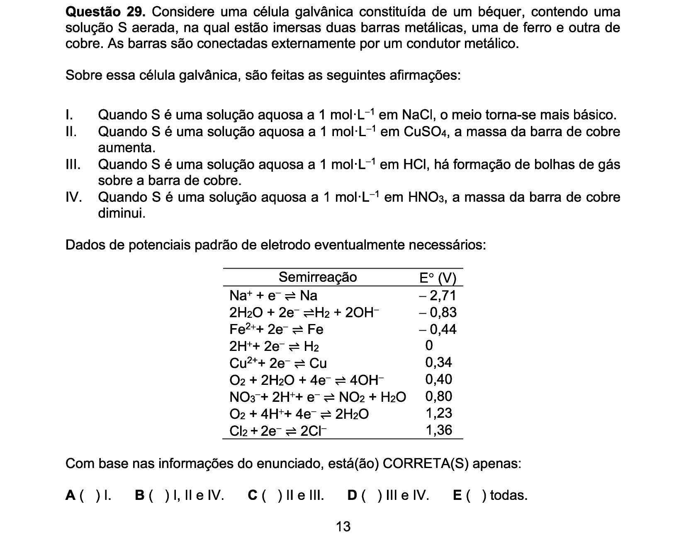

## Q06
**Assunto:** equilíbrio químico / propriedades coligativas
**Competências:** equilíbrio em solução, ebulioscopia, constante de equilíbrio, calor de vaporização
**Tipo:** múltipla escolha

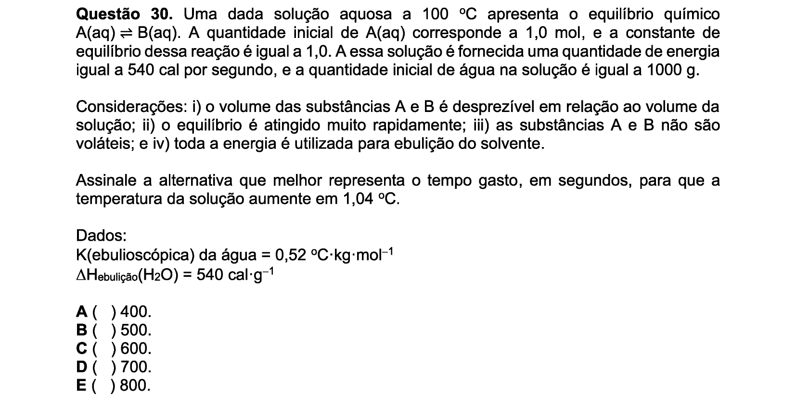

## Q07
**Assunto:** cinética química / propriedades coligativas
**Competências:** reação elementar A→3B, lei de Raoult, pressão de vapor, evolução temporal
**Tipo:** múltipla escolha

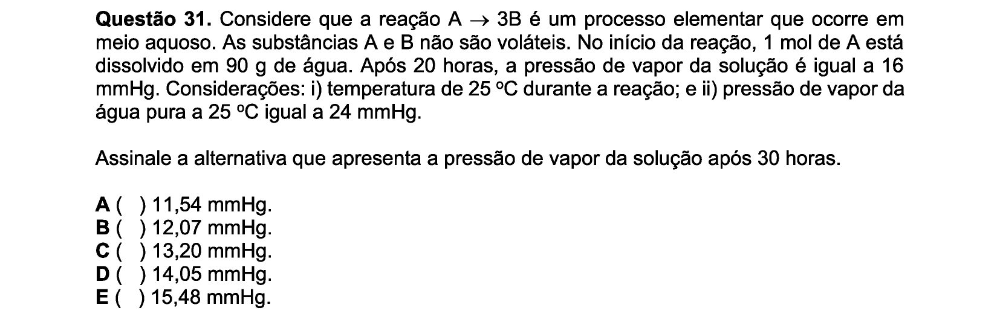

## Q08
**Assunto:** química orgânica
**Competências:** séries homólogas, isólogas e heterólogas, propriedades químicas, asserções I-III
**Tipo:** múltipla escolha (asserções I-III)

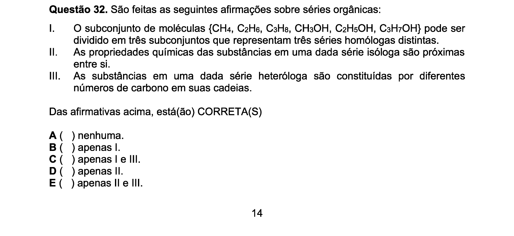

## Q09
**Assunto:** estrutura atômica / leis ponderais
**Competências:** modelos atômicos, raios catódicos, isótopos, massa atômica média, lei das proporções múltiplas, asserções I-IV
**Tipo:** múltipla escolha (asserções I-IV)

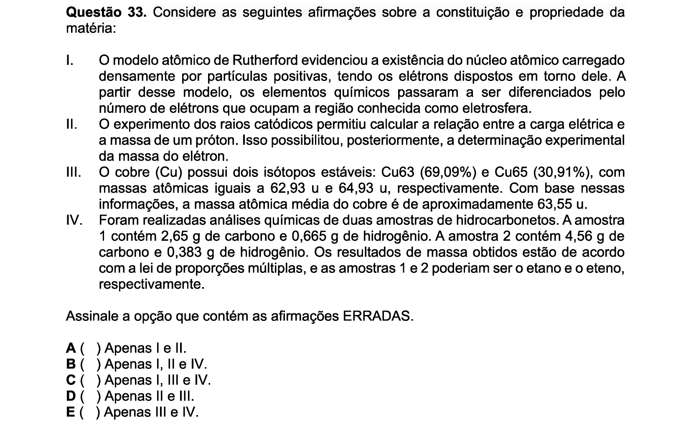

## Q10
**Assunto:** química orgânica
**Competências:** reação de substituição nucleofílica, haloalcanos, carbocátion, solvente polar, asserções I-III
**Tipo:** múltipla escolha (asserções I-III)

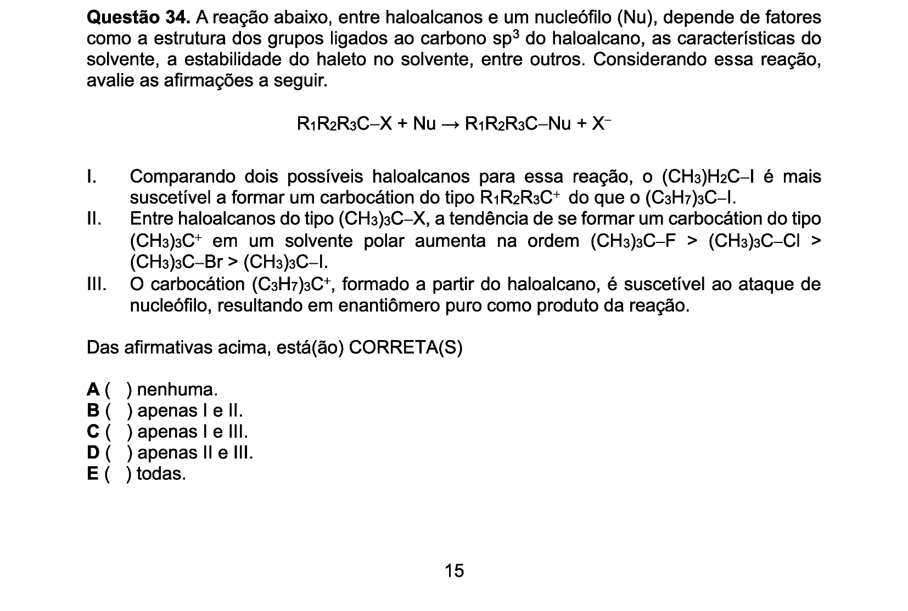

## Q11
**Assunto:** polímeros / estequiometria
**Competências:** polimerização por condensação, PET, ácido tereftálico + etilenoglicol, massa molar, rendimento, densidade
**Tipo:** múltipla escolha

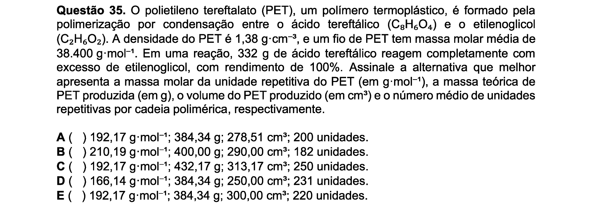

## Q12
**Assunto:** estequiometria / gases
**Competências:** reação em fase gasosa, lei das pressões parciais, consumo de reagente, pressão total
**Tipo:** múltipla escolha

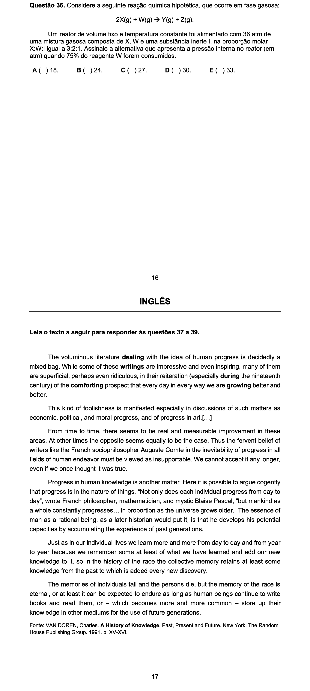
