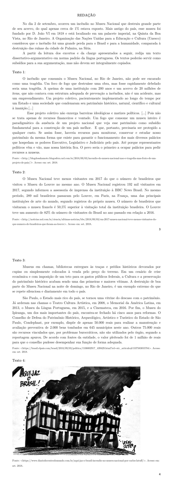

# Redação — ITA 2019 (2ª fase)

> Proposta de redação. Tema: incêndio do Museu Nacional e o descaso com o patrimônio histórico-cultural brasileiro. Gênero: dissertativo-argumentativo.

## Q01
**Assunto:** redação
**Tema:** Incêndio do Museu Nacional e o descaso com o patrimônio histórico-cultural brasileiro
**Gênero:** dissertativo-argumentativo
**Tipo:** discursiva

