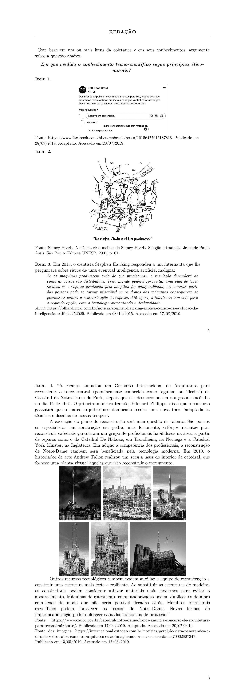

# Redação — ITA 2020 (2ª fase)

> Proposta de redação. Tema: Em que medida o conhecimento tecno-científico segue princípios ético-morais? Gênero: dissertativo-argumentativo.

## Q01
**Assunto:** redação
**Tema:** Em que medida o conhecimento tecno-científico segue princípios ético-morais?
**Gênero:** dissertativo-argumentativo
**Tipo:** discursiva

