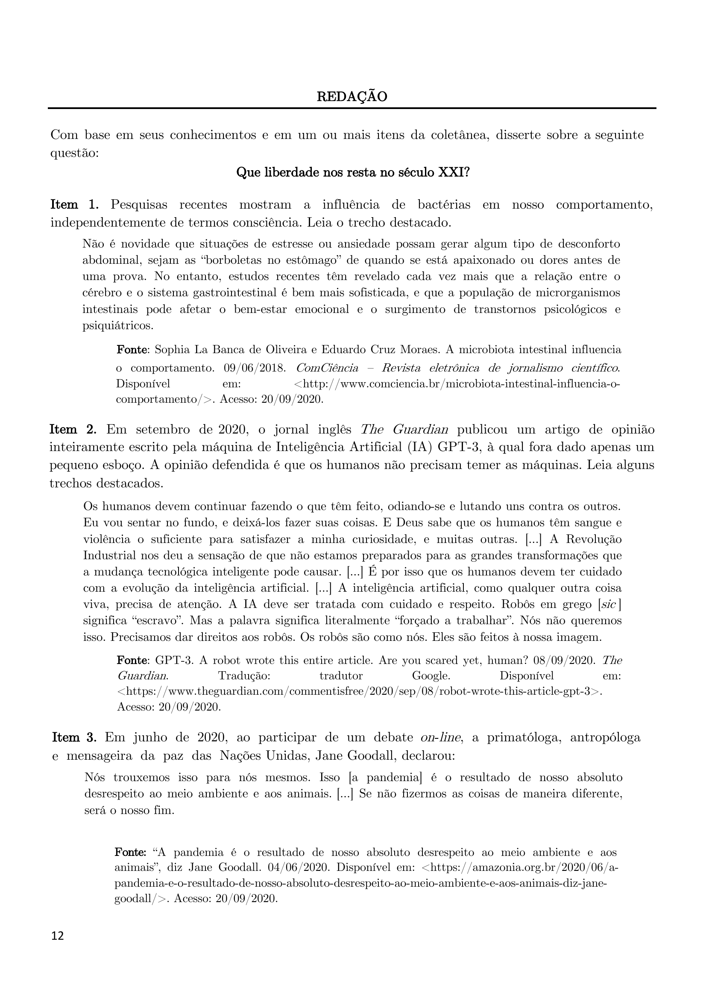

# Redação — ITA 2021 (2ª fase)

> Proposta de redação. Tema: Que liberdade nos resta no século XXI?. Gênero: dissertativo-argumentativo.

## Q01
**Assunto:** redação
**Tema:** Que liberdade nos resta no século XXI?
**Gênero:** dissertativo-argumentativo
**Tipo:** discursiva

