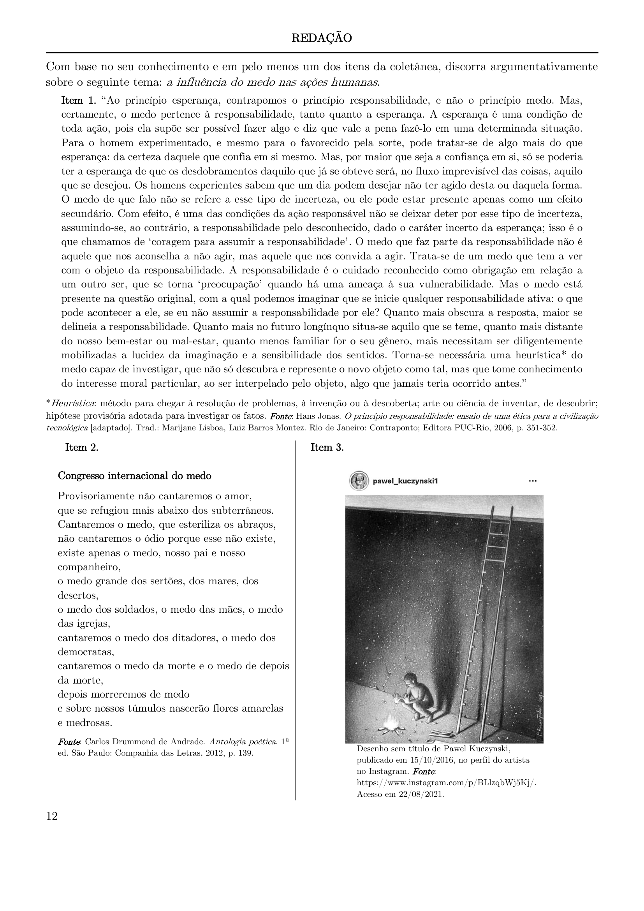

# Redação — ITA 2022 (2ª fase)

> Proposta de redação. Tema: a influência do medo nas ações humanas. Gênero: dissertativo-argumentativo.

## Q01
**Assunto:** redação
**Tema:** a influência do medo nas ações humanas
**Gênero:** dissertativo-argumentativo
**Tipo:** discursiva

