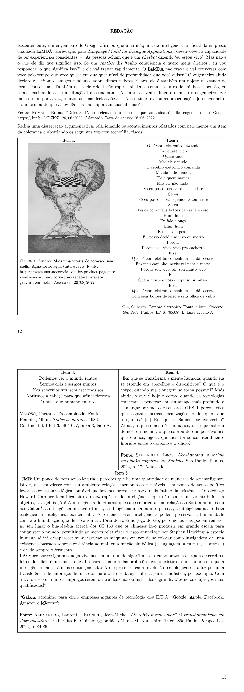

# Redação — ITA 2023 (2ª fase)

> Proposta de redação. Tema: inteligência artificial e a relação entre humanos e máquinas. Gênero: dissertativo-argumentativo.

## Q01
**Assunto:** redação
**Tema:** inteligência artificial e a relação entre humanos e máquinas
**Gênero:** dissertativo-argumentativo
**Tipo:** discursiva

