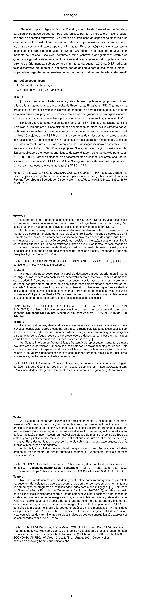

# Redação — ITA 2025 (2ª fase)

> Proposta de redação. Tema: "O papel da Engenharia na construção de um mundo justo e um planeta sustentável". Gênero: dissertativo-argumentativo (25 a 35 linhas, com título).

## Q01
**Assunto:** redação
**Tema:** O papel da Engenharia na construção de um mundo justo e um planeta sustentável
**Gênero:** dissertativo-argumentativo
**Tipo:** discursiva

